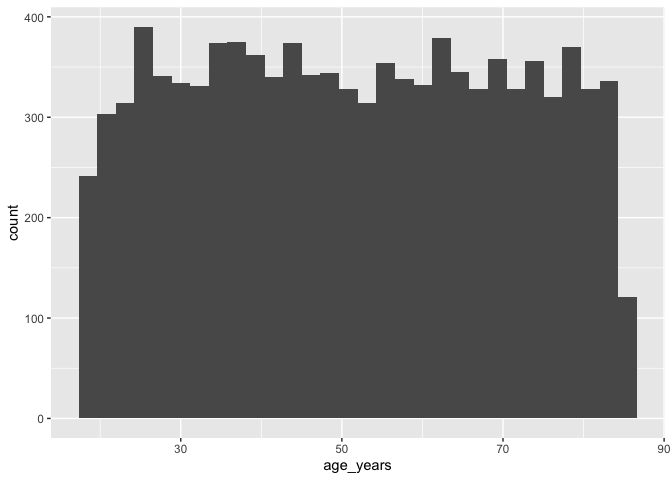

```r
knitr::opts_chunk$set(echo = TRUE)
library(tidyverse)
library(pastecs)
library(knitr)
```

## Reading in the data


```r
data <- read_csv("simulated_data_explore.csv")
```

```
## Parsed with column specification:
## cols(
##   id = col_double(),
##   age_years = col_double(),
##   bench_press_max_lbs = col_double(),
##   height_cm = col_double(),
##   weight_kg = col_double()
## )
```

## 1. Identify the variable types for each variable in the dataset


```r
glimpse(data) 
```

```
## Rows: 10,000
## Columns: 5
## $ id                  <dbl> 1, 2, 3, 4, 5, 6, 7, 8, 9, 10, 11, 12, 13, 14, 15…
## $ age_years           <dbl> 38.62033, 35.26406, 55.00560, 21.77767, 49.39280,…
## $ bench_press_max_lbs <dbl> 122.34489, 133.98912, 85.90034, 216.96535, 95.661…
## $ height_cm           <dbl> 161.0401, 151.7275, 160.7133, 147.2229, 145.1975,…
## $ weight_kg           <dbl> 54.07658, 24.98297, 55.13407, 65.85491, 67.43110,…
```

1. id
    * Definition - Unique identifier for each participant
    * Type - qualitative, nominal
2. age_years
    * Age of the participants in years
    * Type - quantitative, discrete
3. **continue write up for the rest of the variables**

## 2. Calculate the BMI for each participant


```r
data <- data %>%
          mutate(
            bmi = weight_kg/((height_cm/100)^2)
          )
```

## 3. Calculate a young and old variable as per data dictionary


```r
data <- data %>%
          mutate(age_category = case_when(
            age_years < 40 ~ "young", 
            age_years >= 40 ~ "old", 
          ))
```

## 4. Calculate the mean and standard deviation
    * For the variables were it is appropriate
    * Including the new variables you have created


```r
mean(data$age_years)
```

```
## [1] 51.51981
```

```r
mean(data$bench_press_max_lbs)
```

```
## [1] 109.134
```

```r
mean(data$height_cm)
```

```
## [1] 154.8626
```

```r
mean(data$weight_kg)
```

```
## [1] 61.90602
```

```r
mean(data$bmi)
```

```
## [1] 26.0272
```

The mean age of the sampe is 51.5198058 this suggests that the sample may be slightly older than we would expect based on the Canadian Census the average age in Newfoundland and Labrador is 44.8 years old ([https://www150.statcan.gc.ca/n1/pub/71-607-x/71-607-x2020018-eng.htm](https://www150.statcan.gc.ca/n1/pub/71-607-x/71-607-x2020018-eng.htm)).

**continue write up for the rest of the variables**

5. Calculate the frequencies 
    For the variables were it is appropriate to do so
    

```r
table(data$age_category)
```

```
## 
##   old young 
##  6702  3298
```

## 6. Draw the histogram
    * Discuss the normality of the data 

## Histogram for age


```r
age_histogram <- ggplot(data, aes(age_years)) + 
                    geom_histogram()
plot(age_histogram)
```

```
## `stat_bin()` using `bins = 30`. Pick better value with `binwidth`.
```

<!-- -->

Age appears to be mostly a uniform distribution with nearly an equal number of people across age categories in the sample. 

**continue write up for the rest of the variables**

7. Are there missing data? 

```r
data %>%
  summarise(count = sum(is.na(age_years)))
```

```
## # A tibble: 1 x 1
##   count
##   <int>
## 1     0
```

The output of the count of missing data is 0. There are no missing data for age in the dataset

**continue write up for the rest of the variables**

8. Are there outliers? 


```r
summary(data$age_years)
```

```
##    Min. 1st Qu.  Median    Mean 3rd Qu.    Max. 
##   18.01   34.96   51.30   51.52   68.17   84.99
```

Examining the output of the summary statistics shows that the minimum value is 18.01 and the maximum value is 84.99. Both of these values are plausible. The histogram also shows no evidence of outliers in the dataset. 

**continue write up for the rest of the variables**

