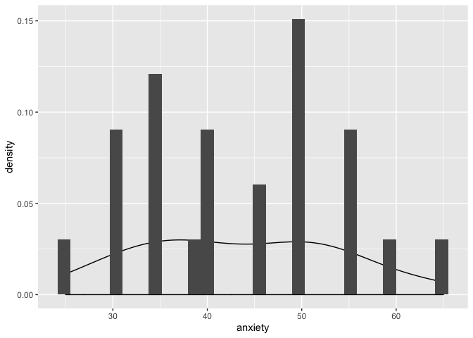
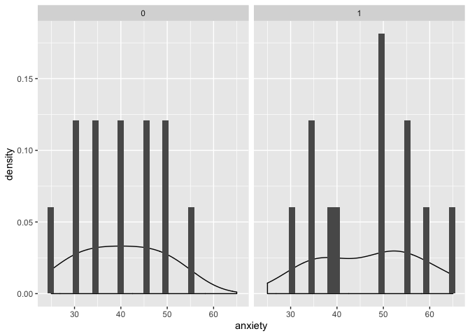
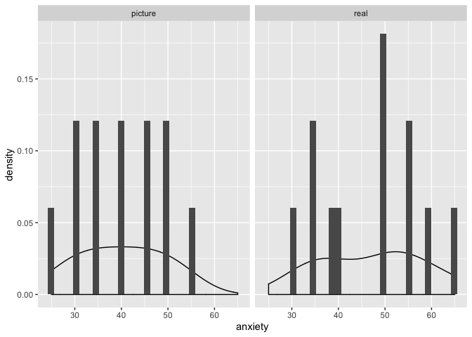
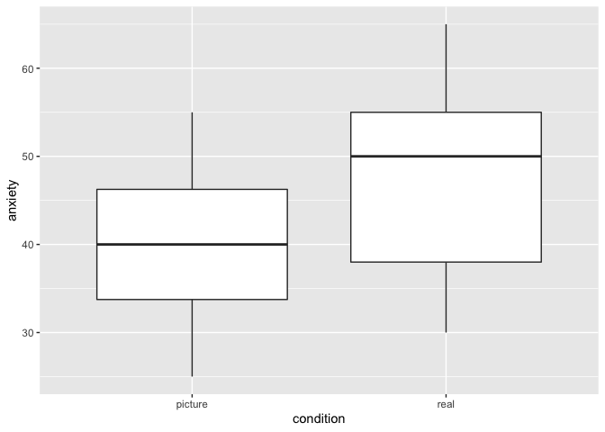
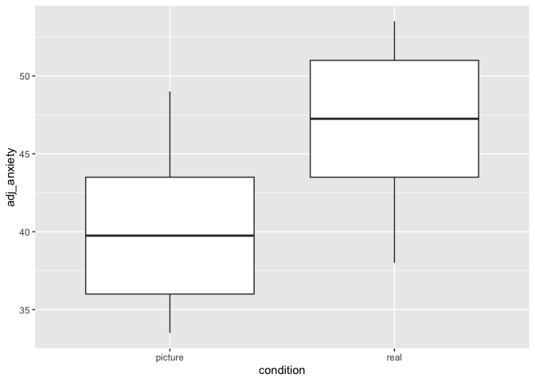

## Comparing Means

### Single sample test

Great explainer here [http://www.sthda.com/english/wiki/one-sample-t-test-in-r](http://www.sthda.com/english/wiki/one-sample-t-test-in-r)


```r
library(tidyverse)
```

```
## ── Attaching packages ───────────────────────────────────────────────────────────── tidyverse 1.2.1 ──
```

```
## ✔ ggplot2 3.2.1     ✔ purrr   0.3.3
## ✔ tibble  2.1.3     ✔ dplyr   0.8.3
## ✔ tidyr   1.0.0     ✔ stringr 1.4.0
## ✔ readr   1.3.1     ✔ forcats 0.4.0
```

```
## ── Conflicts ──────────────────────────────────────────────────────────────── tidyverse_conflicts() ──
## ✖ dplyr::filter() masks stats::filter()
## ✖ dplyr::lag()    masks stats::lag()
```

```r
library(knitr)
library(effsize) 

spider_bg <- read_csv("https://github.com/walkabilly/HKR_6000/raw/master/data/SpiderBG.csv")
```

```
## Parsed with column specification:
## cols(
##   id = col_character(),
##   group = col_double(),
##   anxiety = col_double()
## )
```

```r
str(spider_bg$group)
```

```
##  num [1:24] 0 0 0 0 0 0 0 0 0 0 ...
```

```r
spider_bg$group <- as.factor(spider_bg$group)
```


```r
mean(spider_bg$anxiety)
```

```
## [1] 43.5
```

```r
sd(spider_bg$anxiety)
```

```
## [1] 10.59532
```

```r
plot_grand_mean <- ggplot(spider_bg, aes(x=anxiety)) + 
                geom_density(aes(y = ..density..)) + 
                geom_histogram(aes(y = ..density..)) 
plot(plot_grand_mean)
```

```
## `stat_bin()` using `bins = 30`. Pick better value with `binwidth`.
```

<!-- -->

```r
single_t_test <- t.test(spider_bg$anxiety, mu = 90, alternative = "two.sided")
single_t_test
```

```
## 
## 	One Sample t-test
## 
## data:  spider_bg$anxiety
## t = -21.5, df = 23, p-value < 2.2e-16
## alternative hypothesis: true mean is not equal to 90
## 95 percent confidence interval:
##  39.02599 47.97401
## sample estimates:
## mean of x 
##      43.5
```


### Independent Sample t-test

Great explainer here [http://www.sthda.com/english/wiki/unpaired-two-samples-t-test-in-r#what-is-unpaired-two-samples-t-test](http://www.sthda.com/english/wiki/unpaired-two-samples-t-test-in-r#what-is-unpaired-two-samples-t-test)


```r
group_means <- spider_bg %>%
                  group_by(group) %>%
                    summarize(
                      mean = mean(anxiety, na.rm = TRUE), 
                      sd = sd(anxiety, na.rm = TRUE),  
                      variance = var(anxiety, na.rm = TRUE),
                      count = n(),                       
                    )

kable(group_means, format = "markdown") #Display
```


|group | mean|        sd|  variance| count|
|:-----|----:|---------:|---------:|-----:|
|0     |   40|  9.293204|  86.36364|    12|
|1     |   47| 11.028888| 121.63636|    12|


```r
plot_means <- ggplot(spider_bg, aes(x=anxiety)) + 
                geom_density(aes(y = ..density..)) + 
                geom_histogram(aes(y = ..density..)) + 
                facet_wrap(~ group)
plot(plot_means)
```

```
## `stat_bin()` using `bins = 30`. Pick better value with `binwidth`.
```

<!-- -->


```r
plot_box <- ggplot(spider_bg, aes(x = group, y = anxiety)) + 
                geom_boxplot() 
plot(plot_box)
```

<!-- -->


```r
levene_test <- var.test(anxiety ~ group, data = spider_bg)
levene_test
```

```
## 
## 	F test to compare two variances
## 
## data:  anxiety by group
## F = 0.71001, num df = 11, denom df = 11, p-value = 0.5797
## alternative hypothesis: true ratio of variances is not equal to 1
## 95 percent confidence interval:
##  0.2043974 2.4663783
## sample estimates:
## ratio of variances 
##          0.7100149
```


```r
ind_t_test_var_eq <- t.test(anxiety ~ group, data = spider_bg, var.equal = TRUE)
ind_t_test_var_eq
```

```
## 
## 	Two Sample t-test
## 
## data:  anxiety by group
## t = -1.6813, df = 22, p-value = 0.1068
## alternative hypothesis: true difference in means is not equal to 0
## 95 percent confidence interval:
##  -15.634222   1.634222
## sample estimates:
## mean in group 0 mean in group 1 
##              40              47
```

```r
ind_t_test_var_uneq <- t.test(anxiety ~ group, data = spider_bg, var.equal = FALSE)
ind_t_test_var_uneq
```

```
## 
## 	Welch Two Sample t-test
## 
## data:  anxiety by group
## t = -1.6813, df = 21.385, p-value = 0.1072
## alternative hypothesis: true difference in means is not equal to 0
## 95 percent confidence interval:
##  -15.648641   1.648641
## sample estimates:
## mean in group 0 mean in group 1 
##              40              47
```


```r
cohen_d <- cohen.d(formula = anxiety ~ group, data = spider_bg)
cohen_d
```

```
## 
## Cohen's d
## 
## d estimate: -0.6864065 (medium)
## 95 percent confidence interval:
##      lower      upper 
## -1.5576365  0.1848236
```

### Dependent samples t-test

Great explainer here [http://www.sthda.com/english/wiki/paired-samples-t-test-in-r](http://www.sthda.com/english/wiki/paired-samples-t-test-in-r)


```r
spider_rm <- read_csv("https://github.com/walkabilly/HKR_6000/raw/master/data/SpiderRM.csv")
```

```
## Parsed with column specification:
## cols(
##   id = col_double(),
##   condition = col_character(),
##   anxiety = col_double()
## )
```

```r
spider_rm$condition <- as.factor(spider_rm$condition)
```


```r
mean(spider_rm$anxiety)
```

```
## [1] 43.5
```

```r
sd(spider_rm$anxiety)
```

```
## [1] 10.59532
```


```r
group_means <- spider_rm %>%
                  group_by(condition) %>%
                    summarize(
                      mean = mean(anxiety, na.rm = TRUE), 
                      sd = sd(anxiety, na.rm = TRUE),  
                      count = n(),                       
                    )

kable(group_means, format = "markdown") #Display
```


|condition | mean|        sd| count|
|:---------|----:|---------:|-----:|
|picture   |   40|  9.293204|    12|
|real      |   47| 11.028888|    12|


```r
plot_means <- ggplot(spider_rm, aes(x=anxiety)) + 
                geom_density(aes(y = ..density..)) + 
                geom_histogram(aes(y = ..density..)) + 
                facet_wrap(~ condition)
plot(plot_means)
```

```
## `stat_bin()` using `bins = 30`. Pick better value with `binwidth`.
```

<!-- -->

### Unadjusted Boxplot


```r
plot_box <- ggplot(spider_rm, aes(x = condition, y = anxiety)) + 
                geom_boxplot() 
plot(plot_box)
```

<!-- -->

#### Ajusting the variables

```r
spider_rm <- spider_rm %>%
                  group_by(id) %>%
                    mutate(
                      id_mean = mean(anxiety, na.rm = TRUE)
                    )

spider_rm$grand_mean <- mean(spider_rm$anxiety)

spider_rm$adj <- spider_rm$grand_mean - spider_rm$id_mean

spider_rm$adj_anxiety <- spider_rm$adj + spider_rm$anxiety
```

### Ajusted anxiety plot


```r
plot_box_adj <- ggplot(spider_rm, aes(x = condition, y = adj_anxiety)) + 
                geom_boxplot() 
plot(plot_box_adj)
```

<!-- -->


```r
dep_t_test_var_eq <- t.test(anxiety ~ condition, data = spider_rm, var.equal = TRUE, paired = TRUE)
dep_t_test_var_eq
```

```
## 
## 	Paired t-test
## 
## data:  anxiety by condition
## t = -2.4725, df = 11, p-value = 0.03098
## alternative hypothesis: true difference in means is not equal to 0
## 95 percent confidence interval:
##  -13.2312185  -0.7687815
## sample estimates:
## mean of the differences 
##                      -7
```
