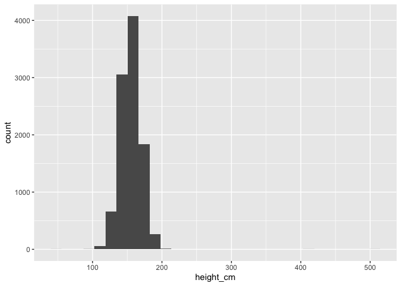
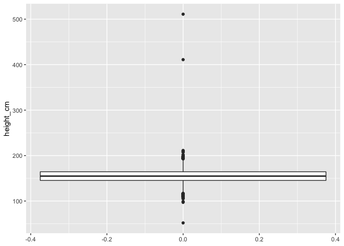
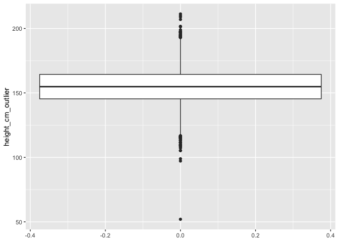
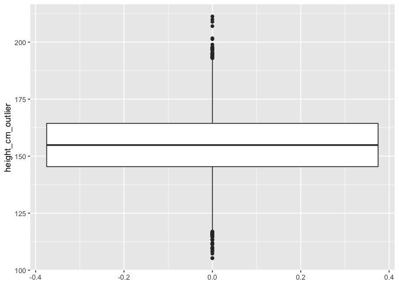
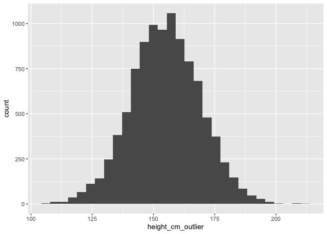

```r
knitr::opts_chunk$set(echo = TRUE)
```


```r
library(tidyverse)
```

```
## ── Attaching packages ──────────────────────────────────────────────────────────────────────────────────────── tidyverse 1.3.0 ──
```

```
## ✓ ggplot2 3.3.2     ✓ purrr   0.3.4
## ✓ tibble  3.0.3     ✓ dplyr   1.0.2
## ✓ tidyr   1.1.2     ✓ stringr 1.4.0
## ✓ readr   1.3.1     ✓ forcats 0.5.0
```

```
## ── Conflicts ─────────────────────────────────────────────────────────────────────────────────────────── tidyverse_conflicts() ──
## x dplyr::filter() masks stats::filter()
## x dplyr::lag()    masks stats::lag()
```

```r
library(knitr)
```

## Reading in the data


```r
setwd("/Users/dfuller/Dropbox/Teaching/MUN/HKR 6000/HKR_6000_git")
data <- read_csv("data/simulated_data_missing.csv")
```

```
## Parsed with column specification:
## cols(
##   id = col_double(),
##   age_years = col_double(),
##   bench_press_max_lbs = col_double(),
##   height_cm = col_double(),
##   weight_kg = col_double()
## )
```

## 1. Identify the variable types for each variable in the dataset


```r
glimpse(data) 
```

```
## Rows: 10,000
## Columns: 5
## $ id                  <dbl> 1, 2, 3, 4, 5, 6, 7, 8, 9, 10, 11, 12, 13, 14, 15…
## $ age_years           <dbl> 38.62033, 35.26406, 55.00560, 21.77767, 49.39280,…
## $ bench_press_max_lbs <dbl> 122.34489, 133.98912, 85.90034, 216.96535, 95.661…
## $ height_cm           <dbl> 161.0401, 151.7275, 511.0000, 147.2229, 145.1975,…
## $ weight_kg           <dbl> 54.07658, 24.98297, 55.13407, 65.85491, 67.43110,…
```

## 2. For __each variable separately__ answer and conduct the analysis for the following

### Examining data for height


```r
summary(data$height_cm)
```

```
##    Min. 1st Qu.  Median    Mean 3rd Qu.    Max.    NA's 
##    52.0   145.4   154.9   154.9   164.4   511.0      28
```

### Are their outliers? 

There appear to be outliers based on the summary measure. The max is 511 which is not a plausible value. Need to explore more to see if there are other outliers. 
        

```r
histo_height <- ggplot(data = data, aes(height_cm)) + 
                  geom_histogram()
plot(histo_height)
```

```
## `stat_bin()` using `bins = 30`. Pick better value with `binwidth`.
```

```
## Warning: Removed 28 rows containing non-finite values (stat_bin).
```

<!-- -->

The histogram sugggests that there are vlaues that are will outside of the distribution. Let's try a box plot. 


```r
boxplot_height <- ggplot(data = data, aes(height_cm)) + 
                  geom_boxplot() +
                  coord_flip()
plot(boxplot_height)
```

```
## Warning: Removed 28 rows containing non-finite values (stat_boxplot).
```

<!-- -->

There appear to two values that are extreme. Over 400am tall. Maybe what happened is that the height was recorded as Feet and Inches instead of centimeters. 

Let's sort the for the highest values in the data and see exactly what those highest values are 


```r
head(arrange(data, desc(height_cm)), 10)
```

```
## # A tibble: 10 x 5
##       id age_years bench_press_max_lbs height_cm weight_kg
##    <dbl>     <dbl>               <dbl>     <dbl>     <dbl>
##  1     3      55.0                85.9      511       55.1
##  2  9724      76.3                62.0      411       61.9
##  3  6450      30.0               158.       211.      79.7
##  4  2783      69.4                68.1      210.     100. 
##  5  5705      19.9               237.       209.      70.7
##  6  6400      25.5               185.       207.      78.3
##  7  1138      80.2                58.9      202.      73.8
##  8  5355      62.2                75.9      201.      74.0
##  9  7855      54.4                86.8      199.      50.1
## 10  8814      79.2                59.7      198.      73.6
```

Here we see that we have two values that are extreme, 411cm and 511 cm. I'm going to assume that these were wrongly entered as feet and inches instead of centimeres. So 4feet 11inches is 4x12 = 48inches + 11 inches = 59 inches. One inch = 2.54 cm so 59x2.54 = 149.86. 

Let's recode those values. Make sure to create a new variable. You want to be to compare the old and new variables. 


```r
data <- data %>%
          mutate(height_cm_outlier = case_when(
            height_cm == 411 ~ 149.86, 
            height_cm == 511 ~ 175.26,
            TRUE ~ height_cm
          ))
```

Let's compare the boxplots


```r
boxplot_height_outlier <- ggplot() + 
                  geom_boxplot(data = data, aes(height_cm_outlier)) +
                  coord_flip()
plot(boxplot_height_outlier)
```

```
## Warning: Removed 28 rows containing non-finite values (stat_boxplot).
```

<!-- -->

```r
plot(boxplot_height)
```

```
## Warning: Removed 28 rows containing non-finite values (stat_boxplot).
```

<!-- -->

Looks like we still have some errors on the low end of the boxplot. Let's see what the low end of the distribution looks like. Same thing as before.


```r
head(arrange(data, (height_cm)), 10)
```

```
## # A tibble: 10 x 6
##       id age_years bench_press_max_lbs height_cm weight_kg height_cm_outlier
##    <dbl>     <dbl>               <dbl>     <dbl>     <dbl>             <dbl>
##  1    95      78.7                60.0      52        98.3              52  
##  2  2079      77.8                60.8      97.2      23.1              97.2
##  3  6491      81.6                57.9      98.9      67.4              98.9
##  4  8319      28.3               167.      105.       58.7             105. 
##  5  4593      72.9                64.8     105.       35.9             105. 
##  6   929      53.3                88.7     107.       28.5             107. 
##  7   677      18.6               255.      108.       56.8             108. 
##  8  6902      27.6               171.      108.       40.1             108. 
##  9  6520      75.9                62.3     109.       40.4             109. 
## 10  5588      30.4               156.      109.       26.5             109.
```

Ahh. A few things here 

- There is one person coded as 52. Again, let's assume that this is feet and inches and fix it manually. Here we add to our old code to make sure that we are building on our previous work. 

- There are some very small people here. 97.2cm is very short. Is it plausible? Maybe. But lets say we want to remove those people. 

##### Recoding the feet inches problem


```r
data <- data %>%
          mutate(height_cm_outlier = case_when(
            height_cm == 411 ~ 149.86, 
            height_cm == 511 ~ 175.26,
            height_cm == 52 ~ 157.48,
            TRUE ~ height_cm
          ))
```

##### Removing the two smallest people

Here we should go from 10,000 people in the data to 9998 people in the data. Here we need to keep the NA values and keep remove the other values. 


```r
data_no_outliers <- filter(data, is.na(height_cm_outlier) | height_cm_outlier > 100)
```

### Outliers fixed height data

Let's compare the boxplots one more time. Make sure to use your new dataframe `data_no_outliers`. 


```r
boxplot_height_outlier <- ggplot() + 
                  geom_boxplot(data = data_no_outliers, aes(height_cm_outlier)) +
                  coord_flip()
plot(boxplot_height_outlier)
```

```
## Warning: Removed 28 rows containing non-finite values (stat_boxplot).
```

<!-- -->

### Outliers included height data

```r
plot(boxplot_height)
```

```
## Warning: Removed 28 rows containing non-finite values (stat_boxplot).
```

<!-- -->

### Are their missing data?

Now we can start working from our variable with no outliers


```r
summary(data_no_outliers$height_cm_outlier)
```

```
##    Min. 1st Qu.  Median    Mean 3rd Qu.    Max.    NA's 
##   105.2   145.4   154.9   154.9   164.4   211.3      28
```

```r
data %>%
  summarise(count = sum(is.na(height_cm_outlier)))
```

```
## # A tibble: 1 x 1
##   count
##   <int>
## 1    28
```

Both our summary and our is.na function tell us there are 28 missing data points in the data. In this sample of 10000 people I would generally just leave those people be missing because it represents a very small portion of the data (0.28% of the data). So let's leave them out and create a new analysis dataset. If we remove the people with missing data for height we would expect our dataset to go from 10,000 observations to 9,972 observations. 


```r
data_clean <- drop_na(data_no_outliers, height_cm_outlier)
```

Ok. That looks good. Now we have an analysis dataset that is clean for height. We can compare our old and new variables for height. 

### Analysis dataset


```r
summary(data_clean$height_cm)
```

```
##    Min. 1st Qu.  Median    Mean 3rd Qu.    Max. 
##    52.0   145.4   154.9   154.9   164.4   511.0
```

```r
summary(data_clean$height_cm_outlier)
```

```
##    Min. 1st Qu.  Median    Mean 3rd Qu.    Max. 
##   105.2   145.4   154.9   154.9   164.4   211.3
```

In the clean height variable the min and max are different. Our mean and median have changed very slightly. 

Let's look at the histograms


```r
histo_clean <- ggplot(data = data_clean, aes(height_cm)) + 
                  geom_histogram() 
plot(histo_clean)
```

```
## `stat_bin()` using `bins = 30`. Pick better value with `binwidth`.
```

<!-- -->

```r
histo_clean_outliers <- ggplot(data = data_clean, aes(height_cm_outlier)) + 
                  geom_histogram() 
plot(histo_clean_outliers)
```

```
## `stat_bin()` using `bins = 30`. Pick better value with `binwidth`.
```

<!-- -->

Much better. We now have a clean looking histogram for height. We have delt with outliers and missing data. 


