## Linear Regression

### Checking the data

Check the data as usual with descriptive statistics and data visualization (*** not shown)


```r
library(tidyverse)
```

```
## ── Attaching packages ───────────────────────────────────────────────────────────────── tidyverse 1.2.1 ──
```

```
## ✔ ggplot2 3.2.1     ✔ purrr   0.3.3
## ✔ tibble  2.1.3     ✔ dplyr   0.8.3
## ✔ tidyr   1.0.0     ✔ stringr 1.4.0
## ✔ readr   1.3.1     ✔ forcats 0.4.0
```

```
## ── Conflicts ──────────────────────────────────────────────────────────────────── tidyverse_conflicts() ──
## ✖ dplyr::filter() masks stats::filter()
## ✖ dplyr::lag()    masks stats::lag()
```

```r
library(car)
```

```
## Loading required package: carData
```

```
## 
## Attaching package: 'car'
```

```
## The following object is masked from 'package:dplyr':
## 
##     recode
```

```
## The following object is masked from 'package:purrr':
## 
##     some
```

```r
library(scatterplot3d)


cchs <- read_csv("https://github.com/walkabilly/HKR_6000/blob/master/data/CCHS_2012.csv?raw=true")
```

```
## Parsed with column specification:
## cols(
##   .default = col_double()
## )
```

```
## See spec(...) for full column specifications.
```

```r
str(cchs$dhhgage)
```

```
##  num [1:124929] 11 14 7 16 9 6 16 7 7 10 ...
```

```r
str(cchs$hwtgbmi)
```

```
##  num [1:124929] 26.3 27.3 23.8 28.7 24.9 ...
```

```r
str(cchs$geogprv)
```

```
##  num [1:124929] 35 59 35 46 24 48 12 48 35 59 ...
```

### Descriptive statistics


```r
summary(cchs$dhhgage)
```

```
##    Min. 1st Qu.  Median    Mean 3rd Qu.    Max. 
##   1.000   6.000  10.000   9.296  13.000  16.000
```

```r
summary(cchs$geogprv)
```

```
##    Min. 1st Qu.  Median    Mean 3rd Qu.    Max. 
##   10.00   24.00   35.00   36.25   47.00   60.00
```

```r
summary(cchs$hwtgbmi)
```

```
##    Min. 1st Qu.  Median    Mean 3rd Qu.    Max. 
##   11.91   22.63   25.65   88.40   29.93  999.99
```


```r
cchs <- cchs %>%
	mutate(geogprv_name = case_when(
		geogprv == 10 ~ "NFLD & LAB",
		geogprv == 11 ~ "PEI",
		geogprv == 12 ~ "NOVA SCOTIA",
		geogprv == 13 ~ "NEW BRUNSWICK",
		geogprv == 24 ~ "QUEBEC",
		geogprv == 35 ~ "ONTARIO",
		geogprv == 46 ~ "MANITOBA",
		geogprv == 47 ~ "SASKATCHEWAN",
		geogprv == 48 ~ "ALBERTA",
		geogprv == 59 ~ "BRITISH COLUMBIA",
		geogprv == 60 ~ "YUKON/NWT/NUNA",
		geogprv == 96 ~ "NOT APPLICABLE",
		geogprv == 97 ~ "DON'T KNOW",
		geogprv == 98 ~ "REFUSAL",
		TRUE ~ "NOT STATED"
	))
```

### Sample n in each province


```r
str(cchs$geogprv_name)  # Change variable name
```

```
##  chr [1:124929] "ONTARIO" "BRITISH COLUMBIA" "ONTARIO" "MANITOBA" ...
```

```r
cchs$geogprv_name <- as.factor(cchs$geogprv_name)
table(cchs$geogprv_name)
```

```
## 
##          ALBERTA BRITISH COLUMBIA         MANITOBA    NEW BRUNSWICK 
##            11321            15413             6962             4786 
##       NFLD & LAB      NOVA SCOTIA          ONTARIO              PEI 
##             3625             4629            42915             1774 
##           QUEBEC     SASKATCHEWAN   YUKON/NWT/NUNA 
##            23260             7161             3083
```

### Visualization


```r
age_histogram <- ggplot(cchs, aes(dhhgage)) + 
                  geom_histogram()
plot(age_histogram)
```

```
## `stat_bin()` using `bins = 30`. Pick better value with `binwidth`.
```

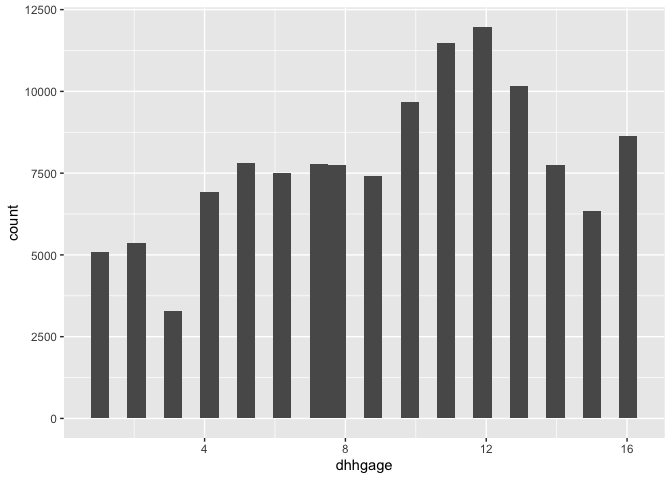<!-- -->

```r
bmi_histogram <- ggplot(cchs, aes(hwtgbmi)) + 
                  geom_histogram()
plot(bmi_histogram)
```

```
## `stat_bin()` using `bins = 30`. Pick better value with `binwidth`.
```

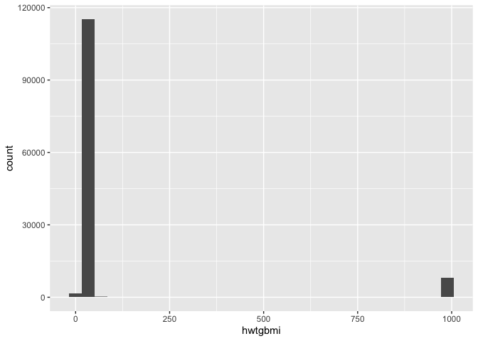<!-- -->

Appears to be BMI values coded as 999.99 among others. We need to recode. I'm just going to say anyting greater than 100 should be NA.


```r
cchs <- cchs %>% mutate(hwtgbmi = case_when(
	hwtgbmi > 100.0 ~ NA_real_,
	TRUE ~ hwtgbmi
))

summary(cchs$hwtgbmi)
```

```
##    Min. 1st Qu.  Median    Mean 3rd Qu.    Max.    NA's 
##   11.91   22.40   25.49   26.10   28.93   54.96    7992
```

```r
bmi_histogram <- ggplot(cchs, aes(hwtgbmi)) + 
                  geom_histogram()
plot(bmi_histogram)
```

```
## `stat_bin()` using `bins = 30`. Pick better value with `binwidth`.
```

```
## Warning: Removed 7992 rows containing non-finite values (stat_bin).
```

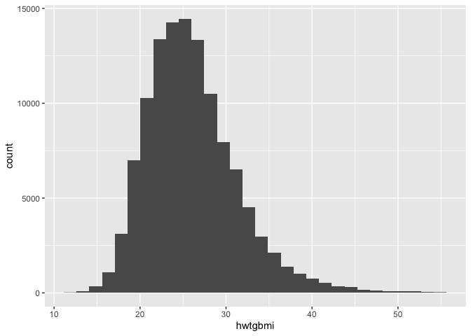<!-- -->

OK. That looks better. 

### Scatter plot age by BMI


```r
bmi_age <- ggplot(cchs, aes(x = dhhgage, y = hwtgbmi)) + 
                  geom_point()
plot(bmi_age)
```

```
## Warning: Removed 7992 rows containing missing values (geom_point).
```

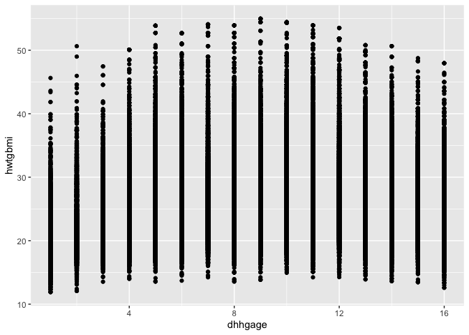<!-- -->

### Scatter plot age by BMI adding a regression line


```r
bmi_age <- ggplot(cchs, aes(x = dhhgage, y = hwtgbmi)) + 
                  geom_point() + 
                  geom_smooth(method='lm', formula = y ~ x)
plot(bmi_age)
```

```
## Warning: Removed 7992 rows containing non-finite values (stat_smooth).
```

```
## Warning: Removed 7992 rows containing missing values (geom_point).
```

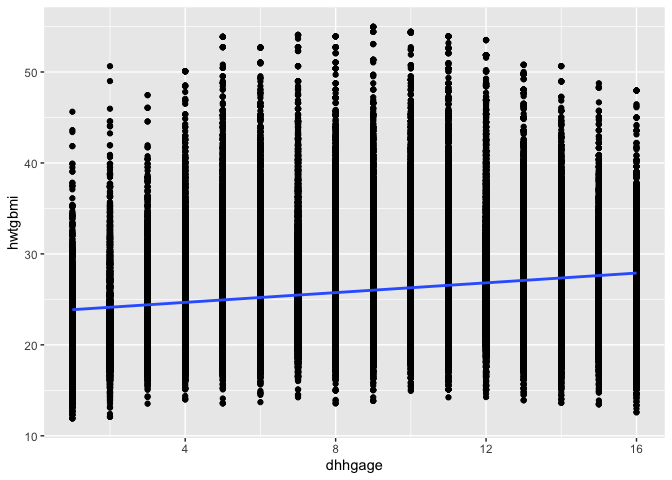<!-- -->

### Scatterplot province by BMI


```r
bmi_prov <- ggplot(cchs, aes(x = geogprv_name, y = hwtgbmi)) + 
                  geom_point()
plot(bmi_prov)
```

```
## Warning: Removed 7992 rows containing missing values (geom_point).
```

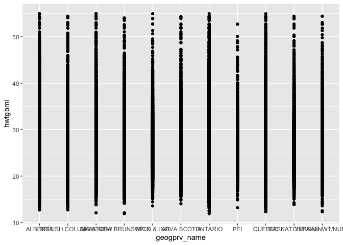<!-- -->

### Scatter plot age by BMI adding a regression line


```r
bmi_prov <- ggplot(cchs, aes(x = geogprv_name, y = hwtgbmi)) + 
                  geom_point() + 
                  geom_smooth(method='lm')
plot(bmi_prov)
```

```
## Warning: Removed 7992 rows containing non-finite values (stat_smooth).
```

```
## Warning: Removed 7992 rows containing missing values (geom_point).
```

<!-- -->

We know we have 7992 rows missing so we will remove those


```r
cchs <- cchs %>% drop_na(hwtgbmi)
```


### Regression with bmi as the outcome and age as the predictor


```r
lm_bmi_age <- lm(hwtgbmi ~ dhhgage, data = cchs)
summary(lm_bmi_age)
```

```
## 
## Call:
## lm(formula = hwtgbmi ~ dhhgage, data = cchs)
## 
## Residuals:
##      Min       1Q   Median       3Q      Max 
## -15.3013  -3.6129  -0.8222   2.6694  28.9475 
## 
## Coefficients:
##              Estimate Std. Error t value Pr(>|t|)    
## (Intercept) 23.597000   0.037086  636.28   <2e-16 ***
## dhhgage      0.268391   0.003629   73.96   <2e-16 ***
## ---
## Signif. codes:  0 '***' 0.001 '**' 0.01 '*' 0.05 '.' 0.1 ' ' 1
## 
## Residual standard error: 5.215 on 116935 degrees of freedom
## Multiple R-squared:  0.04469,	Adjusted R-squared:  0.04469 
## F-statistic:  5471 on 1 and 116935 DF,  p-value: < 2.2e-16
```

```r
confint(lm_bmi_age)
```

```
##                 2.5 %     97.5 %
## (Intercept) 23.524312 23.6696874
## dhhgage      0.261279  0.2755032
```

```r
anova(lm_bmi_age)
```

```
## Analysis of Variance Table
## 
## Response: hwtgbmi
##               Df  Sum Sq Mean Sq F value    Pr(>F)    
## dhhgage        1  148776  148776  5470.7 < 2.2e-16 ***
## Residuals 116935 3180034      27                      
## ---
## Signif. codes:  0 '***' 0.001 '**' 0.01 '*' 0.05 '.' 0.1 ' ' 1
```

```r
residuals1 <- lm_bmi_age$residuals
summary(residuals1)
```

```
##     Min.  1st Qu.   Median     Mean  3rd Qu.     Max. 
## -15.3013  -3.6129  -0.8222   0.0000   2.6694  28.9475
```

```r
plot(lm_bmi_age)
```

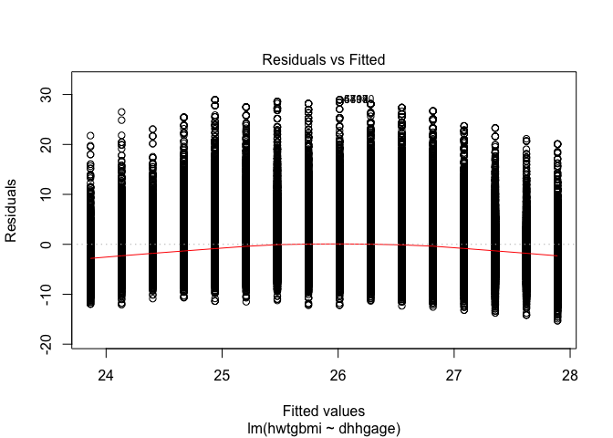<!-- -->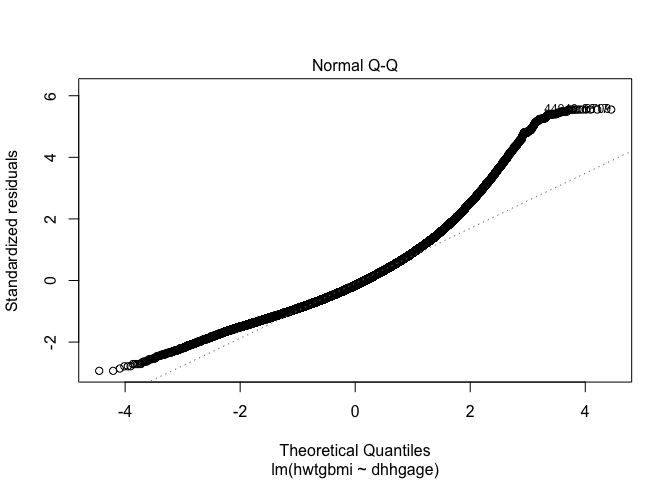<!-- -->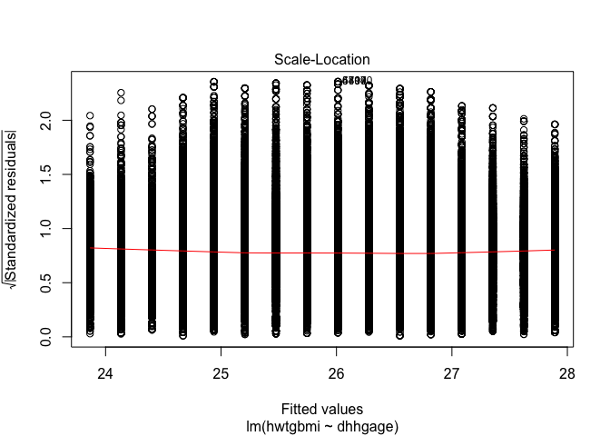<!-- -->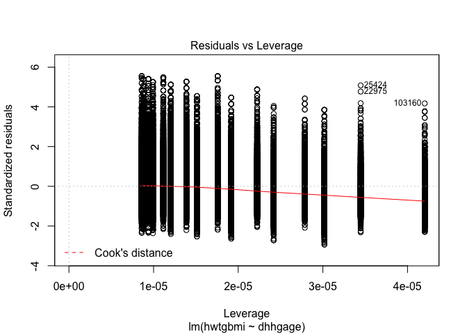<!-- -->

### Regression with bmi as the outcome and province as the predictor


```r
lm_bmi_prov <- lm(hwtgbmi ~ factor(geogprv_name), data = cchs)
summary(lm_bmi_prov)
```

```
## 
## Call:
## lm(formula = hwtgbmi ~ factor(geogprv_name), data = cchs)
## 
## Residuals:
##      Min       1Q   Median       3Q      Max 
## -15.0944  -3.6849  -0.6567   2.8151  29.4851 
## 
## Coefficients:
##                                      Estimate Std. Error t value Pr(>|t|)
## (Intercept)                          26.30675    0.05146 511.206  < 2e-16
## factor(geogprv_name)BRITISH COLUMBIA -0.85491    0.06782 -12.605  < 2e-16
## factor(geogprv_name)MANITOBA          0.55571    0.08382   6.630 3.37e-11
## factor(geogprv_name)NEW BRUNSWICK     0.69761    0.09438   7.391 1.46e-13
## factor(geogprv_name)NFLD & LAB        0.80400    0.10524   7.639 2.20e-14
## factor(geogprv_name)NOVA SCOTIA       0.48200    0.09570   5.037 4.74e-07
## factor(geogprv_name)ONTARIO          -0.23614    0.05792  -4.077 4.56e-05
## factor(geogprv_name)PEI               0.32963    0.14011   2.353   0.0186
## factor(geogprv_name)QUEBEC           -0.83180    0.06261 -13.286  < 2e-16
## factor(geogprv_name)SASKATCHEWAN      0.53007    0.08296   6.389 1.67e-10
## factor(geogprv_name)YUKON/NWT/NUNA    0.05976    0.11267   0.530   0.5959
##                                         
## (Intercept)                          ***
## factor(geogprv_name)BRITISH COLUMBIA ***
## factor(geogprv_name)MANITOBA         ***
## factor(geogprv_name)NEW BRUNSWICK    ***
## factor(geogprv_name)NFLD & LAB       ***
## factor(geogprv_name)NOVA SCOTIA      ***
## factor(geogprv_name)ONTARIO          ***
## factor(geogprv_name)PEI              *  
## factor(geogprv_name)QUEBEC           ***
## factor(geogprv_name)SASKATCHEWAN     ***
## factor(geogprv_name)YUKON/NWT/NUNA      
## ---
## Signif. codes:  0 '***' 0.001 '**' 0.01 '*' 0.05 '.' 0.1 ' ' 1
## 
## Residual standard error: 5.31 on 116926 degrees of freedom
## Multiple R-squared:  0.009737,	Adjusted R-squared:  0.009652 
## F-statistic:   115 on 10 and 116926 DF,  p-value: < 2.2e-16
```

```r
confint(lm_bmi_prov)
```

```
##                                            2.5 %     97.5 %
## (Intercept)                          26.20588698 26.4076092
## factor(geogprv_name)BRITISH COLUMBIA -0.98784266 -0.7219860
## factor(geogprv_name)MANITOBA          0.39143297  0.7199894
## factor(geogprv_name)NEW BRUNSWICK     0.51262327  0.8825884
## factor(geogprv_name)NFLD & LAB        0.59772569  1.0102789
## factor(geogprv_name)NOVA SCOTIA       0.29444203  0.6695636
## factor(geogprv_name)ONTARIO          -0.34965729 -0.1226292
## factor(geogprv_name)PEI               0.05501403  0.6042489
## factor(geogprv_name)QUEBEC           -0.95450694 -0.7090920
## factor(geogprv_name)SASKATCHEWAN      0.36745962  0.6926780
## factor(geogprv_name)YUKON/NWT/NUNA   -0.16108188  0.2805936
```

```r
anova(lm_bmi_prov)
```

```
## Analysis of Variance Table
## 
## Response: hwtgbmi
##                          Df  Sum Sq Mean Sq F value    Pr(>F)    
## factor(geogprv_name)     10   32412  3241.2  114.97 < 2.2e-16 ***
## Residuals            116926 3296399    28.2                      
## ---
## Signif. codes:  0 '***' 0.001 '**' 0.01 '*' 0.05 '.' 0.1 ' ' 1
```

```r
residuals2 <- lm_bmi_prov$residuals
summary(residuals2)
```

```
##     Min.  1st Qu.   Median     Mean  3rd Qu.     Max. 
## -15.0944  -3.6849  -0.6567   0.0000   2.8151  29.4851
```

```r
plot(lm_bmi_prov)
```

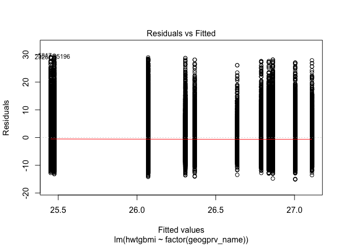<!-- -->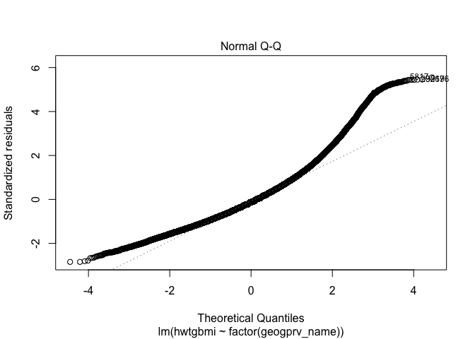<!-- --><!-- -->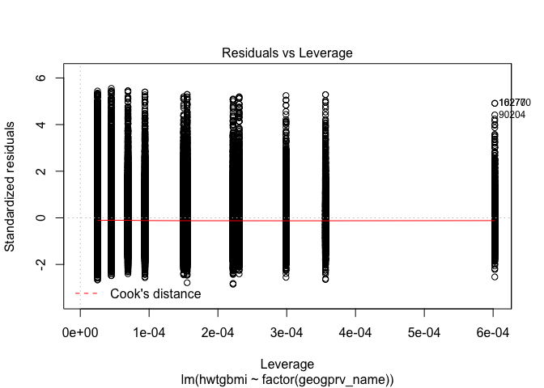<!-- -->

### Multiple regression with bmi as the outcome, age and province as the predictors


```r
linear_model <- lm(hwtgbmi ~ factor(geogprv_name) + dhhgage, data = cchs)
summary(linear_model)
```

```
## 
## Call:
## lm(formula = hwtgbmi ~ factor(geogprv_name) + dhhgage, data = cchs)
## 
## Residuals:
##      Min       1Q   Median       3Q      Max 
## -15.2754  -3.5794  -0.7954   2.6639  29.5586 
## 
## Coefficients:
##                                      Estimate Std. Error t value Pr(>|t|)
## (Intercept)                          23.90904    0.05961 401.120  < 2e-16
## factor(geogprv_name)BRITISH COLUMBIA -1.06952    0.06631 -16.128  < 2e-16
## factor(geogprv_name)MANITOBA          0.42315    0.08190   5.167 2.38e-07
## factor(geogprv_name)NEW BRUNSWICK     0.50217    0.09223   5.445 5.20e-08
## factor(geogprv_name)NFLD & LAB        0.67654    0.10282   6.580 4.74e-11
## factor(geogprv_name)NOVA SCOTIA       0.27140    0.09352   2.902 0.003709
## factor(geogprv_name)ONTARIO          -0.37969    0.05661  -6.707 1.99e-11
## factor(geogprv_name)PEI               0.19817    0.13688   1.448 0.147685
## factor(geogprv_name)QUEBEC           -0.94665    0.06118 -15.474  < 2e-16
## factor(geogprv_name)SASKATCHEWAN      0.36774    0.08107   4.536 5.74e-06
## factor(geogprv_name)YUKON/NWT/NUNA    0.37827    0.11015   3.434 0.000594
## dhhgage                               0.27101    0.00362  74.863  < 2e-16
##                                         
## (Intercept)                          ***
## factor(geogprv_name)BRITISH COLUMBIA ***
## factor(geogprv_name)MANITOBA         ***
## factor(geogprv_name)NEW BRUNSWICK    ***
## factor(geogprv_name)NFLD & LAB       ***
## factor(geogprv_name)NOVA SCOTIA      ** 
## factor(geogprv_name)ONTARIO          ***
## factor(geogprv_name)PEI                 
## factor(geogprv_name)QUEBEC           ***
## factor(geogprv_name)SASKATCHEWAN     ***
## factor(geogprv_name)YUKON/NWT/NUNA   ***
## dhhgage                              ***
## ---
## Signif. codes:  0 '***' 0.001 '**' 0.01 '*' 0.05 '.' 0.1 ' ' 1
## 
## Residual standard error: 5.187 on 116925 degrees of freedom
## Multiple R-squared:  0.05503,	Adjusted R-squared:  0.05494 
## F-statistic:   619 on 11 and 116925 DF,  p-value: < 2.2e-16
```

```r
confint(linear_model)
```

```
##                                            2.5 %     97.5 %
## (Intercept)                          23.79221102 24.0258637
## factor(geogprv_name)BRITISH COLUMBIA -1.19949639 -0.9395469
## factor(geogprv_name)MANITOBA          0.26263619  0.5836671
## factor(geogprv_name)NEW BRUNSWICK     0.32139397  0.6829455
## factor(geogprv_name)NFLD & LAB        0.47500688  0.8780717
## factor(geogprv_name)NOVA SCOTIA       0.08809599  0.4547057
## factor(geogprv_name)ONTARIO          -0.49064236 -0.2687388
## factor(geogprv_name)PEI              -0.07011356  0.4664599
## factor(geogprv_name)QUEBEC           -1.06656075 -0.8267477
## factor(geogprv_name)SASKATCHEWAN      0.20883394  0.5266427
## factor(geogprv_name)YUKON/NWT/NUNA    0.16238501  0.5941653
## dhhgage                               0.26391049  0.2781009
```

```r
anova(linear_model)
```

```
## Analysis of Variance Table
## 
## Response: hwtgbmi
##                          Df  Sum Sq Mean Sq F value    Pr(>F)    
## factor(geogprv_name)     10   32412    3241  120.48 < 2.2e-16 ***
## dhhgage                   1  150775  150775 5604.42 < 2.2e-16 ***
## Residuals            116925 3145623      27                      
## ---
## Signif. codes:  0 '***' 0.001 '**' 0.01 '*' 0.05 '.' 0.1 ' ' 1
```

```r
residuals3 <- linear_model$residuals
summary(residuals3)
```

```
##     Min.  1st Qu.   Median     Mean  3rd Qu.     Max. 
## -15.2754  -3.5794  -0.7954   0.0000   2.6639  29.5586
```

```r
plot(linear_model)
```

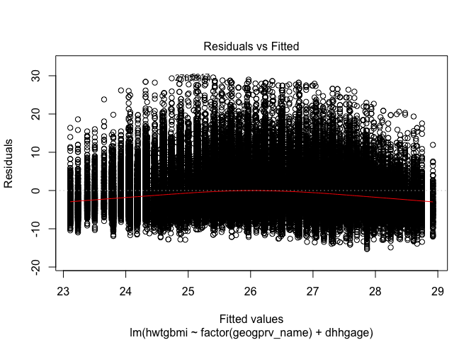<!-- -->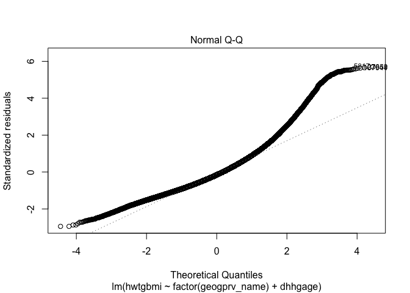<!-- -->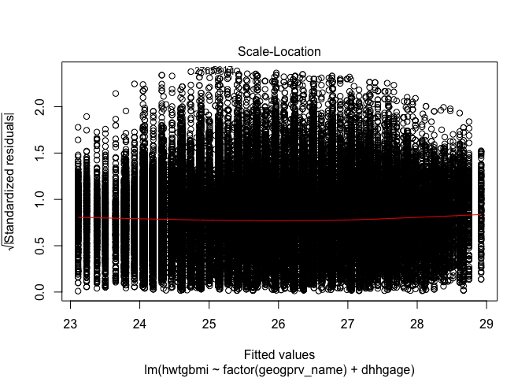<!-- -->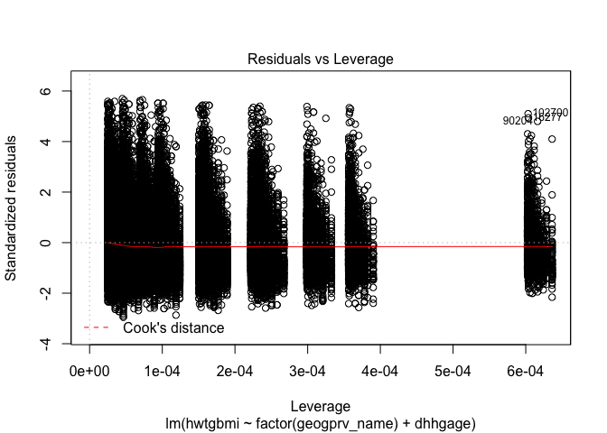<!-- -->


