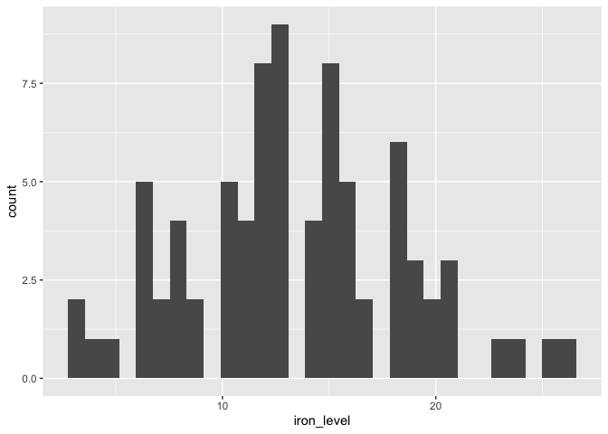
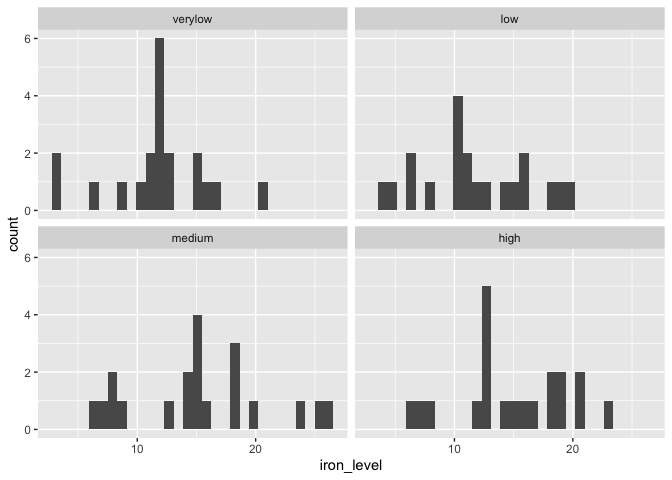
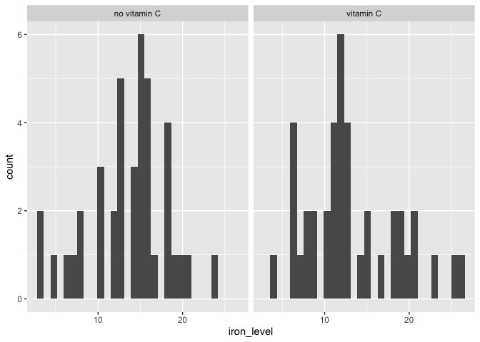
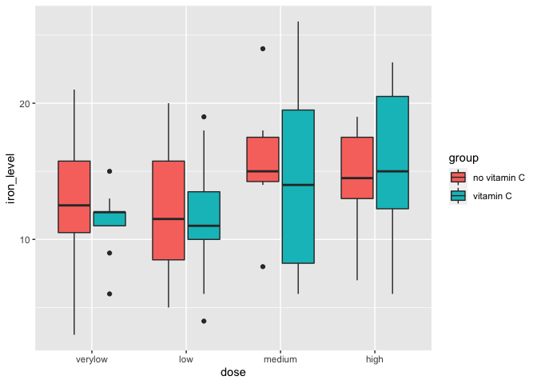
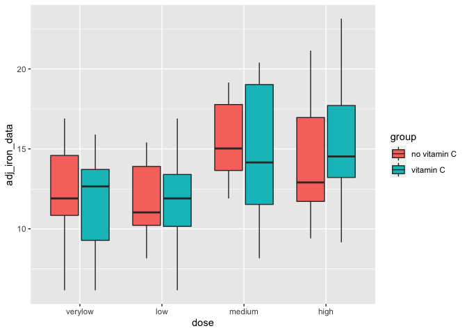

## Repeated Measures ANOVA

### Checking the data


```r
library(tidyverse)
```

```
## ── Attaching packages ─────────────────────────────────────────────────────────────────── tidyverse 1.3.0 ──
```

```
## ✓ ggplot2 3.3.2     ✓ purrr   0.3.4
## ✓ tibble  3.0.3     ✓ dplyr   1.0.2
## ✓ tidyr   1.1.2     ✓ stringr 1.4.0
## ✓ readr   1.3.1     ✓ forcats 0.5.0
```

```
## ── Conflicts ────────────────────────────────────────────────────────────────────── tidyverse_conflicts() ──
## x dplyr::filter() masks stats::filter()
## x dplyr::lag()    masks stats::lag()
```

```r
library(car)
```

```
## Loading required package: carData
```

```
## 
## Attaching package: 'car'
```

```
## The following object is masked from 'package:dplyr':
## 
##     recode
```

```
## The following object is masked from 'package:purrr':
## 
##     some
```

```r
library(kableExtra)
```

```
## 
## Attaching package: 'kableExtra'
```

```
## The following object is masked from 'package:dplyr':
## 
##     group_rows
```

```r
library(rstatix)
```

```
## 
## Attaching package: 'rstatix'
```

```
## The following object is masked from 'package:stats':
## 
##     filter
```

```r
library(lmerTest)
```

```
## Loading required package: lme4
```

```
## Loading required package: Matrix
```

```
## 
## Attaching package: 'Matrix'
```

```
## The following objects are masked from 'package:tidyr':
## 
##     expand, pack, unpack
```

```
## Registered S3 methods overwritten by 'lme4':
##   method                          from
##   cooks.distance.influence.merMod car 
##   influence.merMod                car 
##   dfbeta.influence.merMod         car 
##   dfbetas.influence.merMod        car
```

```
## 
## Attaching package: 'lmerTest'
```

```
## The following object is masked from 'package:lme4':
## 
##     lmer
```

```
## The following object is masked from 'package:stats':
## 
##     step
```

```r
library(pairwiseComparisons)
library(DescTools)
```

```
## 
## Attaching package: 'DescTools'
```

```
## The following object is masked from 'package:car':
## 
##     Recode
```

```r
iron_data <- read_csv("https://raw.githubusercontent.com/walkabilly/HKR_6000/master/assignments/assignment6/RM_ANOVA.csv")
```

```
## Parsed with column specification:
## cols(
##   id = col_double(),
##   group = col_character(),
##   dose = col_character(),
##   iron_level = col_double()
## )
```

```r
str(iron_data$id)
```

```
##  num [1:80] 1 2 3 4 5 6 7 8 9 10 ...
```

```r
iron_data$participant_id <- as.factor(iron_data$id)
str(iron_data$id)
```

```
##  num [1:80] 1 2 3 4 5 6 7 8 9 10 ...
```

```r
str(iron_data$group)
```

```
##  chr [1:80] "no vitamin C" "no vitamin C" "no vitamin C" "no vitamin C" ...
```

```r
str(iron_data$dose)
```

```
##  chr [1:80] "verylow" "verylow" "verylow" "verylow" "verylow" "verylow" ...
```

```r
str(iron_data$iron_level)
```

```
##  num [1:80] 15 3 3 17 13 12 21 10 16 12 ...
```

### Changing the level order 


```r
iron_data$group <- fct_relevel(iron_data$group, c("no vitamin C", "vitamin C"))
iron_data$dose <- fct_relevel(iron_data$dose, c("verylow", "low", "medium", "high"))
```

### Descriptive statistics


```r
summary(iron_data$iron_level)
```

```
##    Min. 1st Qu.  Median    Mean 3rd Qu.    Max. 
##    3.00   10.00   13.00   13.40   16.25   26.00
```

```r
desc_group <- iron_data %>%
                group_by(group, dose) %>%
                  summarise(
                    mean_group = mean(iron_level, na.rm = TRUE),
                    sd_group = sd(iron_level, na.rm = TRUE),
                    median_group = median(iron_level, na.rm = TRUE),
                    variance_group = var(iron_level, na.rm = TRUE),
                  )
```

```
## `summarise()` regrouping output by 'group' (override with `.groups` argument)
```

```r
kable(desc_group, format = "markdown")
```


|group        |dose    | mean_group| sd_group| median_group| variance_group|
|:------------|:-------|----------:|--------:|------------:|--------------:|
|no vitamin C |verylow |       12.2| 5.750362|         12.5|      33.066667|
|no vitamin C |low     |       11.9| 4.886489|         11.5|      23.877778|
|no vitamin C |medium  |       15.7| 4.029061|         15.0|      16.233333|
|no vitamin C |high    |       14.6| 3.502380|         14.5|      12.266667|
|vitamin C    |verylow |       11.3| 2.406011|         12.0|       5.788889|
|vitamin C    |low     |       11.5| 4.672615|         11.0|      21.833333|
|vitamin C    |medium  |       14.7| 7.364328|         14.0|      54.233333|
|vitamin C    |high    |       15.3| 5.793675|         15.0|      33.566667|

### Histogram

```r
iron_histogram <- ggplot(iron_data, aes(iron_level)) + 
                  geom_histogram()
plot(iron_histogram)
```

```
## `stat_bin()` using `bins = 30`. Pick better value with `binwidth`.
```

<!-- -->

### Histogram by group


```r
iron_dose_histogram <- ggplot(iron_data, aes(iron_level)) + 
                  geom_histogram() + 
                  facet_wrap(~ dose)
plot(iron_dose_histogram)
```

```
## `stat_bin()` using `bins = 30`. Pick better value with `binwidth`.
```

<!-- -->

### Histogram by group


```r
iron_group_histogram <- ggplot(iron_data, aes(iron_level)) + 
                  geom_histogram() + 
                  facet_wrap(~ group)
plot(iron_group_histogram)
```

```
## `stat_bin()` using `bins = 30`. Pick better value with `binwidth`.
```

<!-- -->

### Scatter plot iron by group by dose


```r
group_iron <- ggplot(iron_data, aes(x = dose, y = iron_level, fill = group)) + 
                  geom_boxplot() 
plot(group_iron)
```

<!-- -->

### Adjusted scatter plot iron by group by dose


```r
iron_data <- iron_data %>%
                  group_by(id) %>%
                    mutate(
                      id_mean = mean(iron_level, na.rm = TRUE)
                    )

iron_data$grand_mean <- mean(iron_data$iron_level)

iron_data$adj <- iron_data$grand_mean - iron_data$id_mean

iron_data$adj_iron_data <- iron_data$adj + iron_data$iron_level
```


```r
group_iron_adj <- ggplot(iron_data, aes(x = dose, y = adj_iron_data, fill = group)) + 
                  geom_boxplot() 
plot(group_iron_adj)
```

<!-- -->

### Repeated Measures ANOVA analysis - Planned Contrasts

We only have two groups so we don't need fancy contrasts here. 

```{}
### We will adjust the error term in the ANOVA but basically it's the same calls as Assignment 5. 

res_aov <- rstatix::anova_test(data = iron_data, dv = iron_level, wid = participant_id, between = group, within = dose)
get_anova_table(res_aov)

### Run the anova
options(contrasts = c("contr.sum","contr.poly"))
anova_1 <- aov(iron_level ~ group + Error(id/group), data = iron_data)
summary(anova_1) 

results <- lmerTest::get_contrasts_type1(anova_1)
print(results$contrasts)
```

### ANOVA analysis - Polynomial contrasts


```r
### Us the function get to polynomial contrats
contrasts(iron_data$dose) <- contr.poly(4)
anova_2 <- aov(iron_level ~ group, data = iron_data)

summary.aov(anova_2, split=list(group=list("linear"=1, "quadratic" = 2))) 
```

```
##                    Df Sum Sq Mean Sq F value Pr(>F)
## group               1    3.2    3.20   0.122  0.728
##   group: linear     1    3.2    3.20   0.122  0.728
##   group: quadratic  1                              
## Residuals          78 2042.0   26.18
```

# Linear model for RM anova

## Between Model


```r
lm_model_between <- lm(iron_level ~ group, data = iron_data)
summary(lm_model_between)
```

```
## 
## Call:
## lm(formula = iron_level ~ group, data = iron_data)
## 
## Residuals:
##    Min     1Q Median     3Q    Max 
## -10.60  -3.30  -0.20   2.65  12.80 
## 
## Coefficients:
##                Estimate Std. Error t value Pr(>|t|)    
## (Intercept)      13.600      0.809   16.81   <2e-16 ***
## groupvitamin C   -0.400      1.144   -0.35    0.728    
## ---
## Signif. codes:  0 '***' 0.001 '**' 0.01 '*' 0.05 '.' 0.1 ' ' 1
## 
## Residual standard error: 5.117 on 78 degrees of freedom
## Multiple R-squared:  0.001565,	Adjusted R-squared:  -0.01124 
## F-statistic: 0.1222 on 1 and 78 DF,  p-value: 0.7276
```

```r
aov(lm_model_between)
```

```
## Call:
##    aov(formula = lm_model_between)
## 
## Terms:
##                  group Residuals
## Sum of Squares     3.2    2042.0
## Deg. of Freedom      1        78
## 
## Residual standard error: 5.116589
## Estimated effects may be unbalanced
```

## Within model 


```r
### Dose as factor
lm_model_within <- lm(iron_level ~ dose, data = iron_data)
summary(lm_model_within)
```

```
## 
## Call:
## lm(formula = iron_level ~ dose, data = iron_data)
## 
## Residuals:
##    Min     1Q Median     3Q    Max 
## -9.200 -1.950 -0.075  3.100 10.800 
## 
## Coefficients:
##             Estimate Std. Error t value Pr(>|t|)    
## (Intercept)  13.4000     0.5471  24.491   <2e-16 ***
## dose.L        2.9292     1.0943   2.677   0.0091 ** 
## dose.Q       -0.1000     1.0943  -0.091   0.9274    
## dose.C       -1.6323     1.0943  -1.492   0.1399    
## ---
## Signif. codes:  0 '***' 0.001 '**' 0.01 '*' 0.05 '.' 0.1 ' ' 1
## 
## Residual standard error: 4.894 on 76 degrees of freedom
## Multiple R-squared:  0.1101,	Adjusted R-squared:  0.07493 
## F-statistic: 3.133 on 3 and 76 DF,  p-value: 0.03038
```

```r
aov(lm_model_within)
```

```
## Call:
##    aov(formula = lm_model_within)
## 
## Terms:
##                   dose Residuals
## Sum of Squares   225.1    1820.1
## Deg. of Freedom      3        76
## 
## Residual standard error: 4.893739
## Estimated effects are balanced
```

### Dose as continuous

```r
iron_data <- iron_data %>%
          mutate(dose_num = case_when(
            dose == "high" ~ 1, 
            dose == "medium" ~ 2, 
            dose == "low" ~ 3, 
            dose == "verylow" ~ 4
          ))
```


```r
table(iron_data$dose, iron_data$dose_num)
```

```
##          
##            1  2  3  4
##   verylow  0  0  0 20
##   low      0  0 20  0
##   medium   0 20  0  0
##   high    20  0  0  0
```

```r
glimpse(iron_data$dose_num)
```

```
##  num [1:80] 4 4 4 4 4 4 4 4 4 4 ...
```

```r
lm_model_within_num <- lm(iron_level ~ dose_num, data = iron_data)
summary(lm_model_within_num)
```

```
## 
## Call:
## lm(formula = iron_level ~ dose_num, data = iron_data)
## 
## Residuals:
##    Min     1Q Median     3Q    Max 
## -9.365 -2.745  0.565  3.333 11.945 
## 
## Coefficients:
##             Estimate Std. Error t value Pr(>|t|)    
## (Intercept)  16.6750     1.3422  12.424  < 2e-16 ***
## dose_num     -1.3100     0.4901  -2.673  0.00915 ** 
## ---
## Signif. codes:  0 '***' 0.001 '**' 0.01 '*' 0.05 '.' 0.1 ' ' 1
## 
## Residual standard error: 4.901 on 78 degrees of freedom
## Multiple R-squared:  0.08391,	Adjusted R-squared:  0.07216 
## F-statistic: 7.144 on 1 and 78 DF,  p-value: 0.009154
```

```r
aov(lm_model_within_num)
```

```
## Call:
##    aov(formula = lm_model_within_num)
## 
## Terms:
##                 dose_num Residuals
## Sum of Squares    171.61   1873.59
## Deg. of Freedom        1        78
## 
## Residual standard error: 4.90106
## Estimated effects may be unbalanced
```

## Within and Between 


```r
### Factor type (simple contrast)
full_model <- lm(iron_level ~ group*dose, data = iron_data)
summary(full_model)
```

```
## 
## Call:
## lm(formula = iron_level ~ group * dose, data = iron_data)
## 
## Residuals:
##    Min     1Q Median     3Q    Max 
## -9.300 -2.225 -0.200  3.325 11.300 
## 
## Coefficients:
##                       Estimate Std. Error t value Pr(>|t|)    
## (Intercept)            13.6000     0.7923  17.166   <2e-16 ***
## groupvitamin C         -0.4000     1.1205  -0.357    0.722    
## dose.L                  2.4597     1.5846   1.552    0.125    
## dose.Q                 -0.4000     1.5846  -0.252    0.801    
## dose.C                 -2.0125     1.5846  -1.270    0.208    
## groupvitamin C:dose.L   0.9391     2.2409   0.419    0.676    
## groupvitamin C:dose.Q   0.6000     2.2409   0.268    0.790    
## groupvitamin C:dose.C   0.7603     2.2409   0.339    0.735    
## ---
## Signif. codes:  0 '***' 0.001 '**' 0.01 '*' 0.05 '.' 0.1 ' ' 1
## 
## Residual standard error: 5.011 on 72 degrees of freedom
## Multiple R-squared:  0.1161,	Adjusted R-squared:  0.03014 
## F-statistic: 1.351 on 7 and 72 DF,  p-value: 0.2396
```

```r
aov(full_model)
```

```
## Call:
##    aov(formula = full_model)
## 
## Terms:
##                  group   dose group:dose Residuals
## Sum of Squares     3.2  225.1        9.1    1807.8
## Deg. of Freedom      1      3          3        72
## 
## Residual standard error: 5.010822
## Estimated effects may be unbalanced
```

```r
### Numeric type (linear contrast)
full_model_num <- lm(iron_level ~ group*dose_num, data = iron_data)
summary(full_model_num)
```

```
## 
## Call:
## lm(formula = iron_level ~ group * dose_num, data = iron_data)
## 
## Residuals:
##    Min     1Q Median     3Q    Max 
## -9.480 -2.480  0.080  2.975 12.040 
## 
## Coefficients:
##                         Estimate Std. Error t value Pr(>|t|)    
## (Intercept)              16.3500     1.9191   8.520 1.11e-12 ***
## groupvitamin C            0.6500     2.7140   0.240    0.811    
## dose_num                 -1.1000     0.7007  -1.570    0.121    
## groupvitamin C:dose_num  -0.4200     0.9910  -0.424    0.673    
## ---
## Signif. codes:  0 '***' 0.001 '**' 0.01 '*' 0.05 '.' 0.1 ' ' 1
## 
## Residual standard error: 4.955 on 76 degrees of freedom
## Multiple R-squared:  0.08763,	Adjusted R-squared:  0.05161 
## F-statistic: 2.433 on 3 and 76 DF,  p-value: 0.07142
```

```r
aov(full_model_num)
```

```
## Call:
##    aov(formula = full_model_num)
## 
## Terms:
##                   group dose_num group:dose_num Residuals
## Sum of Squares     3.20   171.61           4.41   1865.98
## Deg. of Freedom       1        1              1        76
## 
## Residual standard error: 4.955035
## Estimated effects may be unbalanced
```

```r
### Numeric type (polynomial contrast)
full_model_poly <- lm(iron_level ~ group*dose_num^2, data = iron_data)
summary(full_model_poly)
```

```
## 
## Call:
## lm(formula = iron_level ~ group * dose_num^2, data = iron_data)
## 
## Residuals:
##    Min     1Q Median     3Q    Max 
## -9.480 -2.480  0.080  2.975 12.040 
## 
## Coefficients:
##                         Estimate Std. Error t value Pr(>|t|)    
## (Intercept)              16.3500     1.9191   8.520 1.11e-12 ***
## groupvitamin C            0.6500     2.7140   0.240    0.811    
## dose_num                 -1.1000     0.7007  -1.570    0.121    
## groupvitamin C:dose_num  -0.4200     0.9910  -0.424    0.673    
## ---
## Signif. codes:  0 '***' 0.001 '**' 0.01 '*' 0.05 '.' 0.1 ' ' 1
## 
## Residual standard error: 4.955 on 76 degrees of freedom
## Multiple R-squared:  0.08763,	Adjusted R-squared:  0.05161 
## F-statistic: 2.433 on 3 and 76 DF,  p-value: 0.07142
```

```r
aov(full_model_poly)
```

```
## Call:
##    aov(formula = full_model_poly)
## 
## Terms:
##                   group dose_num group:dose_num Residuals
## Sum of Squares     3.20   171.61           4.41   1865.98
## Deg. of Freedom       1        1              1        76
## 
## Residual standard error: 4.955035
## Estimated effects may be unbalanced
```


