## Data Visualization


```r
library(tidyverse)
```

```
## ── Attaching packages ───────────────────────────────────────────────── tidyverse 1.3.0 ──
```

```
## ✓ ggplot2 3.3.2     ✓ purrr   0.3.4
## ✓ tibble  3.0.3     ✓ dplyr   1.0.2
## ✓ tidyr   1.1.2     ✓ stringr 1.4.0
## ✓ readr   1.3.1     ✓ forcats 0.5.0
```

```
## ── Conflicts ──────────────────────────────────────────────────── tidyverse_conflicts() ──
## x dplyr::filter() masks stats::filter()
## x dplyr::lag()    masks stats::lag()
```

```r
library(wesanderson)
```

## Data Visualization


```r
data <- read_csv("/Users/dfuller/Dropbox/Teaching/MUN/HKR 6000/HKR_6000_git/data/data_viz.csv")
```

```
## Parsed with column specification:
## cols(
##   id = col_double(),
##   CONDITION = col_double(),
##   time = col_double(),
##   mvc_peak = col_double()
## )
```

```r
glimpse(data)
```

```
## Rows: 132
## Columns: 4
## $ id        <dbl> 1, 1, 1, 1, 1, 1, 2, 2, 2, 2, 2, 2, 3, 3, 3, 3, 3, 3, 4, 4,…
## $ CONDITION <dbl> 0, 0, 0, 0, 0, 0, 0, 0, 0, 0, 0, 0, 0, 0, 0, 0, 0, 0, 0, 0,…
## $ time      <dbl> 1, 2, 3, 4, 5, 6, 1, 2, 3, 4, 5, 6, 1, 2, 3, 4, 5, 6, 1, 2,…
## $ mvc_peak  <dbl> 326.7458, 316.5805, 313.2954, 318.2851, 323.7706, 317.7582,…
```

```r
data <- data %>%
          mutate(Condition = case_when(
            CONDITION == 0 ~ "External",
            CONDITION == 1 ~ "Internal"
          ))
          
data$time_f <- as.factor(data$time)
```

## Histogram of mvc_peak


```r
histo_mvc <- ggplot(data = data, aes(mvc_peak)) + 
              geom_histogram()
plot(histo_mvc)
```

```
## `stat_bin()` using `bins = 30`. Pick better value with `binwidth`.
```

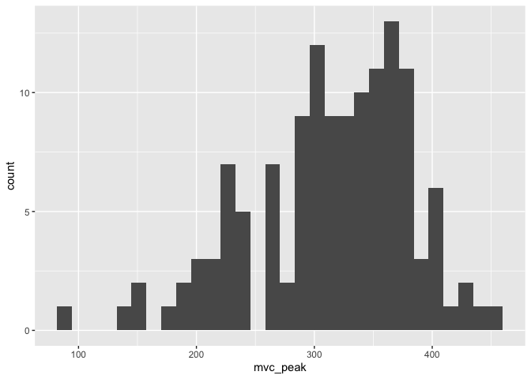<!-- -->

## Different methods to graph mvc_peak by condition


```r
### Bar Graph
histo_mvc_cond <- ggplot(data = data, aes(x=Condition, y=mvc_peak, fill=Condition)) + 
              geom_bar(stat="identity") + 
              theme_classic()
plot(histo_mvc_cond)
```

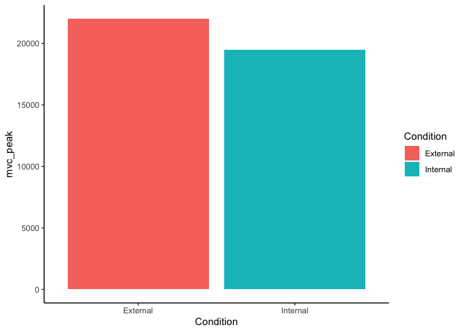<!-- -->

```r
### Box plot 
box_mvc_cond <- ggplot(data = data, aes(x=Condition, y=mvc_peak, fill=Condition)) + 
              geom_boxplot() +
              #scale_fill_brewer(palette="Dark2") + 
              scale_fill_manual(values=wes_palette(n=2, name="GrandBudapest1")) +
              #scale_fill_grey() +
              theme_classic()
plot(box_mvc_cond)
```

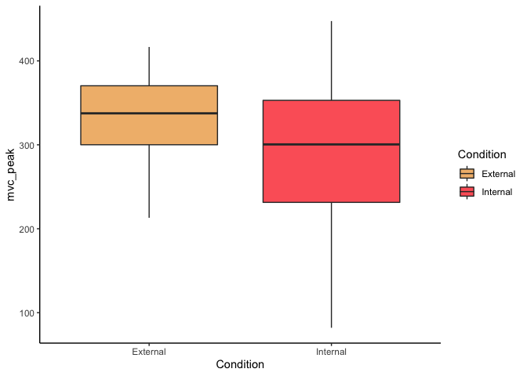<!-- -->

```r
### Violin plot 
violin_mvc_cond <- ggplot(data = data, aes(x=Condition, y=mvc_peak, fill=Condition)) + 
              geom_violin() +
              theme_classic()
plot(violin_mvc_cond)
```

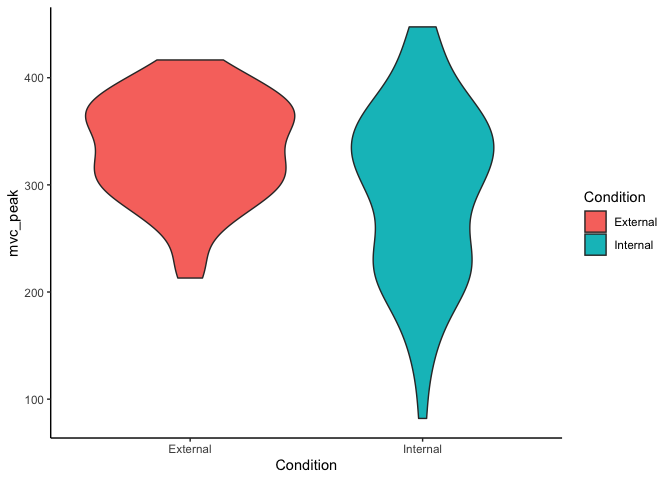<!-- -->

```r
### Scatter plot 
scatter_mvc_cond <- ggplot(data = data, aes(x=Condition, y=mvc_peak, colour=Condition)) + 
              geom_point(alpha = 0.7) +
              theme_classic()
plot(scatter_mvc_cond)
```

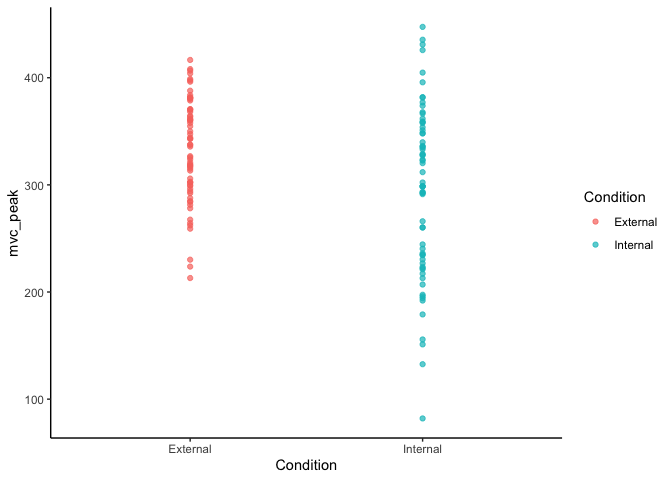<!-- -->

```r
### Jitter plot 
jitter_mvc_cond <- ggplot(data = data, aes(x=Condition, y=mvc_peak, colour=Condition)) +
              geom_jitter(alpha = 0.7) +
              labs(x = "Focus Type",
                   y = "Peak Maximum Contraction (Units)") +
              theme_classic()
plot(jitter_mvc_cond)
```

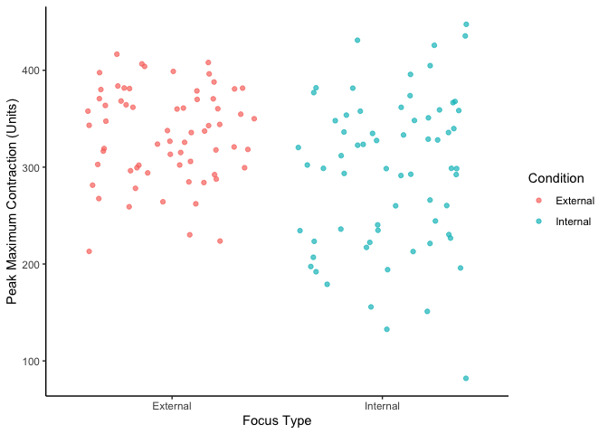<!-- -->

## Combining plot types to show the data 

```r
### Box plot 
box_mvc_cond <- ggplot(data = data, aes(x=Condition, y=mvc_peak)) + 
              geom_boxplot() + 
              geom_jitter(aes(colour = Condition), alpha = 0.7) + 
              theme_classic()
plot(box_mvc_cond)
```

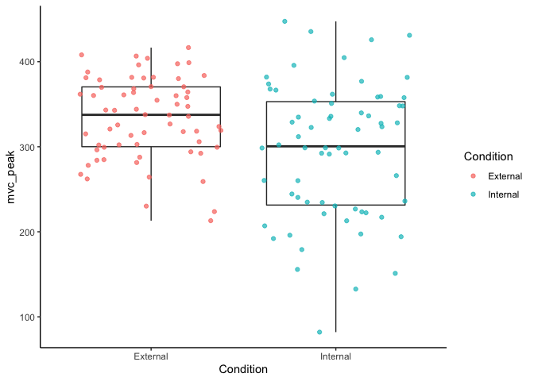<!-- -->

## MVC over time

```r
### Box plot 
bar_mvc_time <- ggplot(data = data, aes(x=time_f, y=mvc_peak, fill=Condition)) + 
              geom_bar(stat="identity", position = "dodge")  
plot(bar_mvc_time)
```

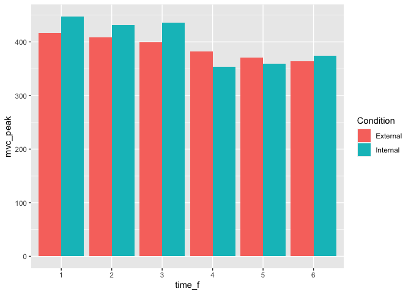<!-- -->

```r
### Box plot 
box_mvc_time <- ggplot(data = data, aes(x=time_f, y=mvc_peak, fill=Condition)) + 
              geom_boxplot() +
              theme_classic()
plot(box_mvc_time)
```

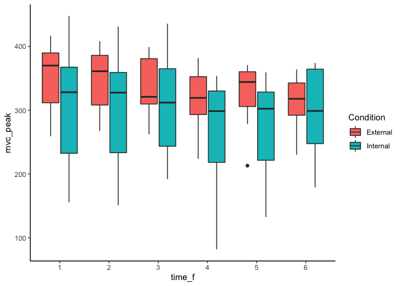<!-- -->

```r
### Violin plot 
violin_mvc_time <- ggplot(data = data, aes(x=time_f, y=mvc_peak, fill=Condition)) + 
              geom_violin() +
              theme_classic()
plot(violin_mvc_time)
```

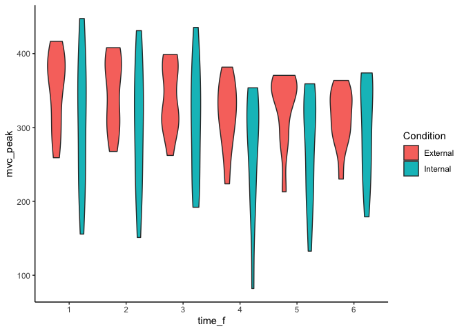<!-- -->

## Example with only 2 time points and one condition

Connecting the points to show change


```r
data_small <- filter(data, time < 3 & Condition == "Internal")

time_line_test <- ggplot(data = data_small, aes(x = time_f, y = mvc_peak, fill = time_f)) +
        geom_boxplot() +
        geom_jitter()
plot(time_line_test)
```

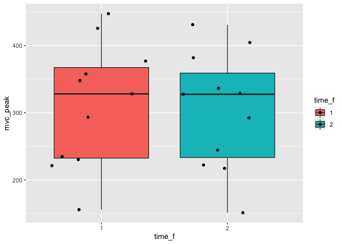<!-- -->

```r
time_line <- ggplot(data = data_small, aes(x=time_f, y=mvc_peak)) +
        geom_boxplot() +
        geom_line(aes(group=id), position = position_dodge(0.2)) +
        geom_point(aes(fill=time_f, group=id), size=2, shape=21, position = position_dodge(0.2)) +
        theme(legend.position = "none") + 
        theme_classic()
plot(time_line)
```

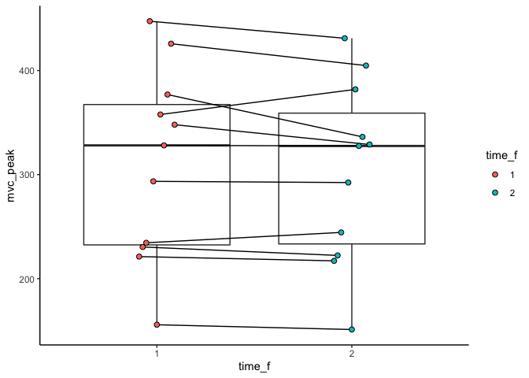<!-- -->

## MVC over time by condition

```r
### Box plot over time (color)
box_mvc_time <- ggplot(data = data, aes(x=time_f, y=mvc_peak, fill = Condition)) + 
              geom_boxplot() +
              theme_classic() 
plot(box_mvc_time)
```

<!-- -->

```r
### Box plot over time (grid)
box_mvc_time_grid <- ggplot(data = data, aes(x=time_f, y=mvc_peak)) + 
              geom_boxplot() + 
              facet_wrap(~ Condition) +
              theme_classic()
plot(box_mvc_time_grid)
```

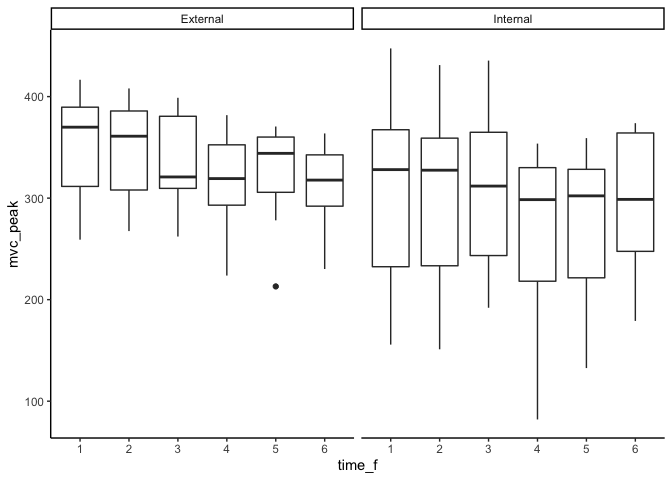<!-- -->

## MVC over time by condition (scatter plot)

```r
### Box plot over time (color)
point_mvc_time <- ggplot(data = data, aes(x=time_f, y=mvc_peak, colour = Condition)) + 
              geom_jitter(alpha = 0.7) +
              geom_smooth(aes(group = Condition)) +
              theme_classic()
plot(point_mvc_time)
```

```
## `geom_smooth()` using method = 'loess' and formula 'y ~ x'
```

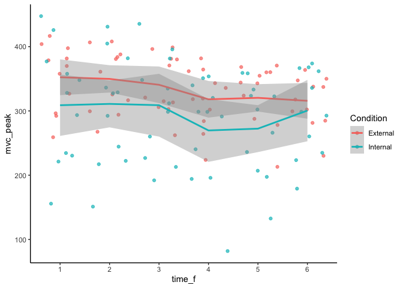<!-- -->
