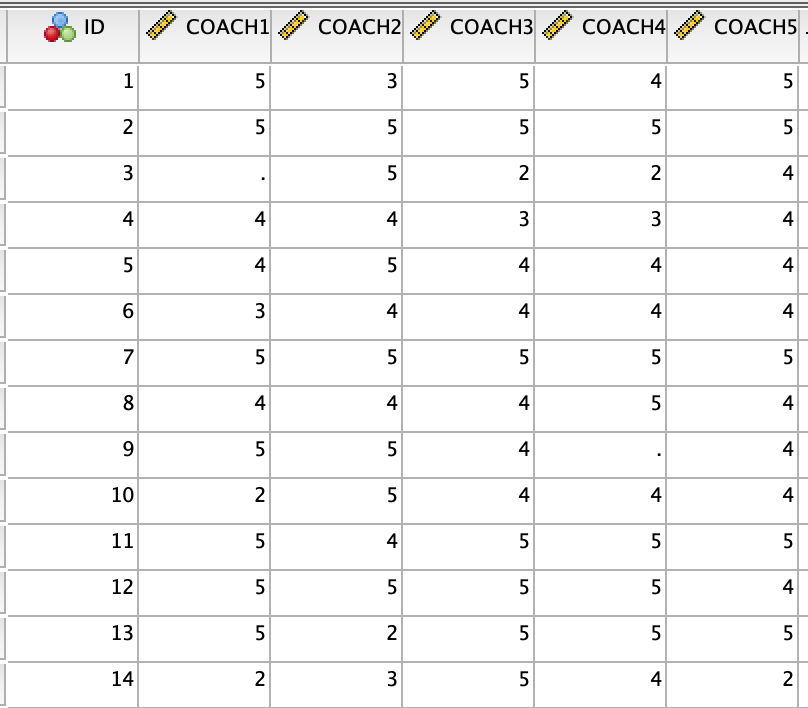
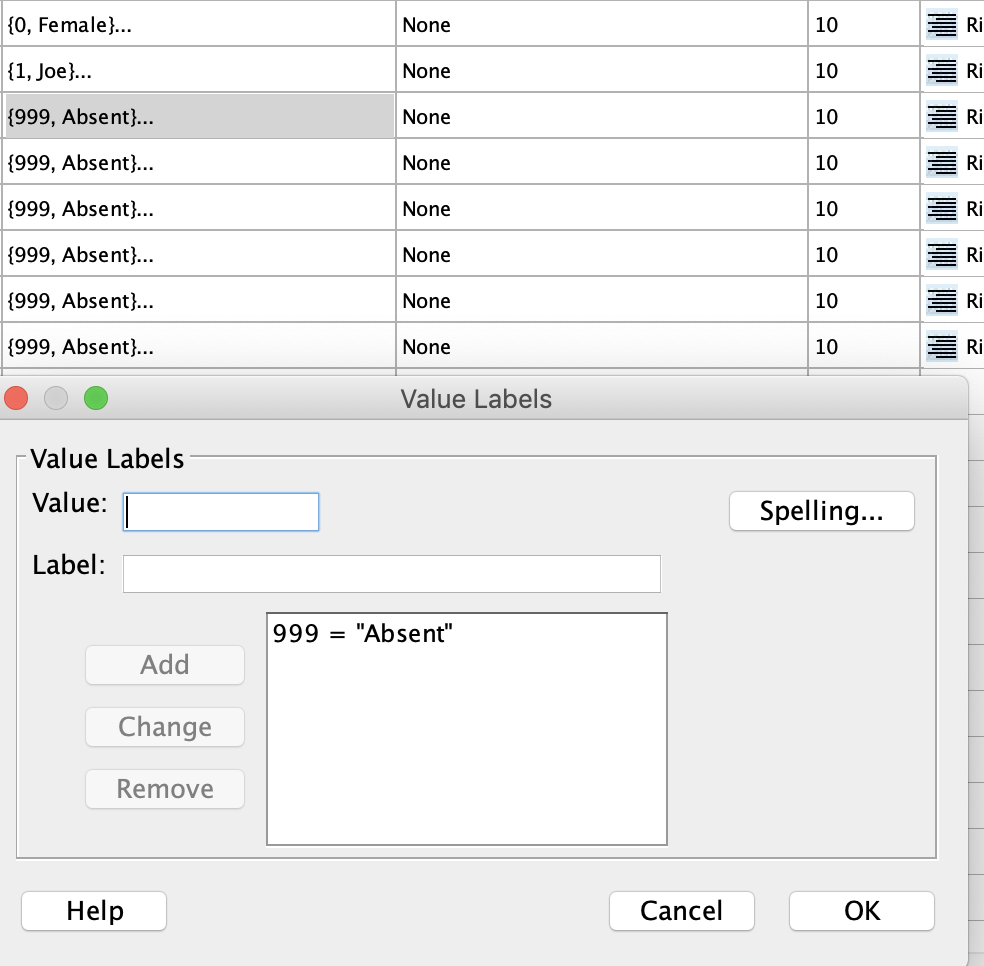
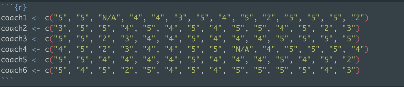
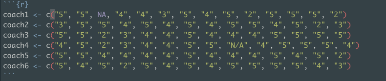

## Comments on assignment 1 

## 1. Be very aware of missing data

#### SPSS 

SPSS make sure you code your data correctly. You can use a blank cell to define missing as below. If you code something and run descriptive statistics make sure you know your total without missing and how many rows each descriptive statistic was calculated on. 



Make sure you code the missing the correct place. Coding missing as a value label is the same is coding NA as a value in R. The statistical program thinks it's a factor level, rather than a missing. 



R, there is a difference between "N/A" and NA. "N/A" is a factor level that does not represent missing. NA represents missing and highlights (purple in my case). If you export a CSV file "N/A" with be N/A in the file. NA will be an empty cell. 





## 2. What type of variable is it? 

Be careful with your variable types. In R using " " will give you a character variable. If you want numeric you can use unquoted text. Use `str` to check the type of variable you have. You can use common recode functions.  
- `as.numeric`
- `as.factor`
- `as.character`


```r
coach1 <- c(1, 2, 3, 4, 5, 6, NA, 7, 8)
str(coach1)
```

```
##  num [1:9] 1 2 3 4 5 6 NA 7 8
```

```r
coach1_factor <- as.factor(coach1)
str(coach1_factor)
```

```
##  Factor w/ 8 levels "1","2","3","4",..: 1 2 3 4 5 6 NA 7 8
```

