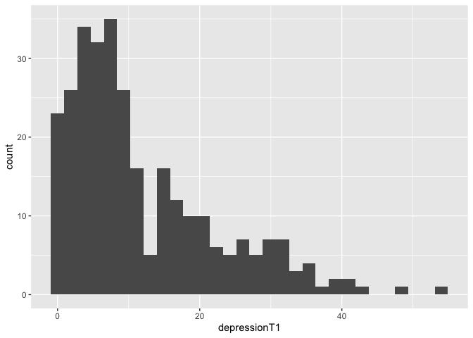

```r
knitr::opts_chunk$set(echo = TRUE)
library(tidyverse)
library(pastecs)
library(knitr)
```

## Reading in the data

Need to remove NA too


```r
data <- read_csv("exploring data.csv")
```

```
## Parsed with column specification:
## cols(
##   .default = col_double()
## )
```

```
## See spec(...) for full column specifications.
```

```r
data <- data %>%
          na_if(777) %>%
          na_if(888) %>%
          na_if(999)
```

## Variables

There are 2 main variables of interest

1. `depressionT1` a continuous measure of depression. 
2. `income1` an ordinal measure of income catories. 

### Checking variables just too make sure I have what I think I do. 


```r
typeof(data$depressionT1)
```

```
## [1] "double"
```

```r
typeof(data$income1)
```

```
## [1] "double"
```

```r
#data$income1 <- as.integer(data$income1)
#typeof(data$income1)
```

`income1` is type double (a number) not an ordinal variable. We need to recode this to ordinal. 


```r
data$income <- as.ordered(data$income1)
typeof(data$income)
```

```
## [1] "integer"
```

## Descriptive statistics for `depressionT1`

Using functin `stat.desc` from `pastecs` package combined with kable from the `knitr` to make a nice table


```r
kable(stat.desc(data$depressionT1))
```

                           x
-------------  -------------
nbr.val          297.0000000
nbr.null          23.0000000
nbr.na            12.0000000
min                0.0000000
max               54.0000000
range             54.0000000
sum             3507.0000000
median             8.0000000
mean              11.8080808
SE.mean            0.6128279
CI.mean.0.95       1.2060519
var              111.5407453
std.dev           10.5612852
coef.var           0.8944117

## Descriptive statistics for `income1`

Income1 is ordinal so doing descriptives like mean is not meaningful. Instead I use frequency tables. 


```r
count <- table(data$income1)  # Table of counts
percent <- prop.table(count, 1)  # Table of percent
table1 <- cbind(count, percent)  # Combine the count and percent tables

kable(table1, format = "markdown") #Display
```


| count| percent|
|-----:|-------:|
|    10|       1|
|    16|       1|
|    25|       1|
|    38|       1|
|    41|       1|
|    17|       1|
|    26|       1|
|    23|       1|
|    85|       1|

## Histogram for `depressionT1`


```r
histo_dep <- ggplot(data, aes(depressionT1)) + 
                geom_histogram() 
plot(histo_dep)
```

```
## `stat_bin()` using `bins = 30`. Pick better value with `binwidth`.
```

```
## Warning: Removed 12 rows containing non-finite values (stat_bin).
```

<!-- -->

## Kolmogorov-Smirnov test

K-S test function includes 2 inputs. First, your variable, second the distribution you want to compare your distribution against. Here we put `rnorm` because we can to compare our distribution against a normal distribution.


```r
ks.test(data$depressionT1, rnorm)
```

```
## Warning in ks.test(data$depressionT1, rnorm): ties should not be present
## for the Kolmogorov-Smirnov test
```

```
## 
## 	One-sample Kolmogorov-Smirnov test
## 
## data:  data$depressionT1
## D = 3.8957, p-value < 2.2e-16
## alternative hypothesis: two-sided
```

## Boxplot for `income1`


```r
bar_income <- ggplot(data, aes(income1)) + 
                geom_bar() 
plot(bar_income)
```

```
## Warning: Removed 28 rows containing non-finite values (stat_count).
```

<!-- -->

## Scatter plot between `depressionT1` and `income1`


```r
scatter_inc_dep <- ggplot(data, aes(income1, depressionT1)) + 
                geom_point() 
plot(scatter_inc_dep)
```

```
## Warning: Removed 36 rows containing missing values (geom_point).
```

<!-- -->

## Correlation 

Choosing Spearman correlation but we need to use `income1` the integer variable to get the correlation value. 


```r
cor.test(data$depressionT1, data$income1, method = "spearman")
```

```
## Warning in cor.test.default(data$depressionT1, data$income1, method =
## "spearman"): Cannot compute exact p-value with ties
```

```
## 
## 	Spearman's rank correlation rho
## 
## data:  data$depressionT1 and data$income1
## S = 3748046, p-value = 0.08249
## alternative hypothesis: true rho is not equal to 0
## sample estimates:
##        rho 
## -0.1052845
```


