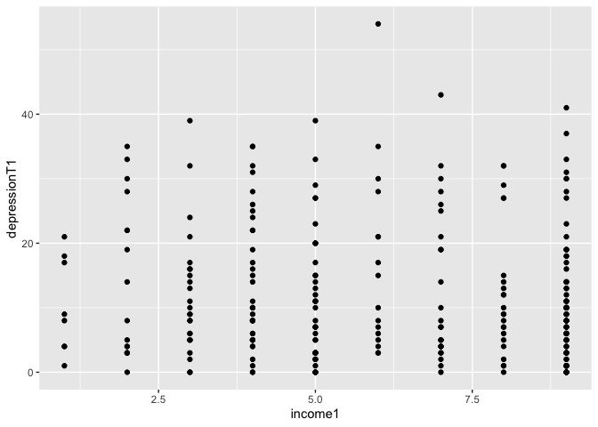

```r
knitr::opts_chunk$set(echo = TRUE)
library(tidyverse)
library(pastecs)
library(knitr)
```

## Reading in the data

Need to remove NA too


```r
data <- read_csv("exploring data.csv")
```

```
## Parsed with column specification:
## cols(
##   .default = col_double()
## )
```

```
## See spec(...) for full column specifications.
```

```r
data <- data %>%
          na_if(777) %>%
          na_if(888) %>%
          na_if(999)
```

## Variables

There are 2 main variables of interest

1. `depressionT1` a continuous measure of depression. 
  - Depression is the dependent variable of this study which was measured using the 20-item Center for Epidemiologic Studies Depression Scale (CES-D; Radloff, 1977). The CES-D is a common measure of depressive symptoms. Respondents are requested to rate the extent to which they experienced 20 symptoms over the past week (eg, “I felt sad”). Items are scored on a 4-point scale, ranging from 0 (rarely or none of the time, less than a day) to 3 (most or all the time, 5–7 days). Scores are computed as the sum of the responses to the items and total scores can range from 0 to 60, with higher scores indicating greater depression symptoms (Time 1: cesd101-cesd120). Scores of 16 or above indicate probable cases of clinical depression.

2. `income1` an ordinal measure of income catories. 
  - Income is the independent variable in the study. Income was measured from <$5,000 to >$40,000 in $5,000 increments. There were 9 income categories. 

### Checking variables just too make sure I have what I think I do. 


```r
typeof(data$depressionT1)
```

```
## [1] "double"
```

```r
typeof(data$income1)
```

```
## [1] "double"
```

```r
#data$income1 <- as.integer(data$income1)
#typeof(data$income1)
```

`income1` is type double (a number) not an ordinal variable. We need to recode this to ordinal. 


```r
data$income <- as.ordered(data$income1)
typeof(data$income)
```

```
## [1] "integer"
```

## Sample Description

```r
table(data$cgsex)
```

```
## 
##   1   2 
## 238  71
```

```r
sum(table(data$cgsex))
```

```
## [1] 309
```

```r
summary(data$educ)
```

```
##    Min. 1st Qu.  Median    Mean 3rd Qu.    Max. 
##   1.000   4.000   6.000   5.725   7.000   8.000
```

```r
summary(data$income1)
```

```
##    Min. 1st Qu.  Median    Mean 3rd Qu.    Max.    NA's 
##   1.000   4.000   6.000   6.075   9.000   9.000      28
```

```r
table(data$mstat1)
```

```
## 
##   1   2   3   4   5   6 
##  40  12 206   4  26  21
```

```r
table(data$dement1)
```

```
## 
##   0   1 
## 181 127
```

At Time 1, 77.1% of the caregivers were female. Mean caregiver age was 62.8 (SD = 14.23), and the sample was predominately Caucasian (79.0%). The caregivers in this sample were highly educated, with 60.3% attaining at least some university or college education. Median household income was $25,000 to 30,000 per year (SD = $15,000). Almost half of caregivers were spouses (45.8%) and more than one third (38.7%) were adult children of care recipients. Care recipients had a wide variety of disabling conditions with 41% diagnosed with Alzheimer’s disease or other forms of dementia.

Figures 1 and 2 are histograms for the independent and dependent variables. The histogram for activity restriction in sports and recreation appears to be somewhat normally distributed, but has a positive skew due to the mode of this data being 1 (on a 5-point scale 0-4). The histogram for depression illustrates that the data is very positively skewed and there appears to be several outliers who have very severe depression.

## Descriptive statistics for `depressionT1`

Using functin `stat.desc` from `pastecs` package combined with kable from the `knitr` to make a nice table


```r
kable(stat.desc(data$depressionT1))
```

                           x
-------------  -------------
nbr.val          297.0000000
nbr.null          23.0000000
nbr.na            12.0000000
min                0.0000000
max               54.0000000
range             54.0000000
sum             3507.0000000
median             8.0000000
mean              11.8080808
SE.mean            0.6128279
CI.mean.0.95       1.2060519
var              111.5407453
std.dev           10.5612852
coef.var           0.8944117

## Descriptive statistics for `income1`

Income1 is ordinal so doing descriptives like mean is not meaningful. Instead I use frequency tables. For full marks you should recode this to it's meaningful when displayed. 


```r
count <- table(data$income)  # Table of counts
kable(count, format = "markdown") #Display
```


|Var1 | Freq|
|:----|----:|
|1    |   10|
|2    |   16|
|3    |   25|
|4    |   38|
|5    |   41|
|6    |   17|
|7    |   26|
|8    |   23|
|9    |   85|

## Histogram and boxplot for `depressionT1`


```r
histo_dep <- ggplot(data, aes(depressionT1)) + 
                geom_histogram() + 
                ggtitle("Figure 1. Histogram of Depression")
plot(histo_dep)
```

```
## `stat_bin()` using `bins = 30`. Pick better value with `binwidth`.
```

```
## Warning: Removed 12 rows containing non-finite values (stat_bin).
```

<!-- -->

```r
box_dep <- ggplot(data, aes("depressionT1", depressionT1)) + 
                geom_boxplot() + 
                ggtitle("Figure 2. Boxplot of Depression")
plot(box_dep)
```

```
## Warning: Removed 12 rows containing non-finite values (stat_boxplot).
```

<!-- -->

## Kolmogorov-Smirnov test

K-S test function includes 2 inputs. First, your variable, second the distribution you want to compare your distribution against. Here we put `rnorm` because we can to compare our distribution against a normal distribution.


```r
ks.test(data$depressionT1, rnorm)
```

```
## Warning in ks.test(data$depressionT1, rnorm): ties should not be present
## for the Kolmogorov-Smirnov test
```

```
## 
## 	One-sample Kolmogorov-Smirnov test
## 
## data:  data$depressionT1
## D = 3.55, p-value < 2.2e-16
## alternative hypothesis: two-sided
```

## Boxplot for `income1`


```r
bar_income <- ggplot(data, aes(income1)) + 
                geom_bar() + 
                ggtitle("Figure 3. Barplot of Income Categories")
plot(bar_income)
```

```
## Warning: Removed 28 rows containing non-finite values (stat_count).
```

<!-- -->

## Normality Tests

Tests for normality were performed. Depression was extremely positive skewed (Zskewness = 8.40) and the distribution was leptkurtic (Zkurtosis = 3.56). Depression at time 1 was not  (D = 3.77, p < .001). Box plots indicated six outliers in depression; these were caregivers who had high depression scores (score of 38 and over). On average caregivers were slightly restricted in their sports and recreation activates due to


## Scatter plot between `depressionT1` and `income1`


```r
scatter_inc_dep <- ggplot(data, aes(income1, depressionT1)) + 
                geom_point() + 
                ggtitle("Figure 4. Scatterplot of Income Categories\nand Depression")
plot(scatter_inc_dep)
```

```
## Warning: Removed 36 rows containing missing values (geom_point).
```

<!-- -->

## Correlation 

Choosing Spearman correlation but we need to use `income1` the integer variable to get the correlation value. 


```r
cor.test(data$depressionT1, data$income1, method = "spearman")
```

```
## Warning in cor.test.default(data$depressionT1, data$income1, method =
## "spearman"): Cannot compute exact p-value with ties
```

```
## 
## 	Spearman's rank correlation rho
## 
## data:  data$depressionT1 and data$income1
## S = 3748046, p-value = 0.08249
## alternative hypothesis: true rho is not equal to 0
## sample estimates:
##        rho 
## -0.1052845
```

### Correlations

Figure 4 illustrates a scatter plot of income and depression. This graph illustrates that there does not generally appear to be a linear relationship between income and depression. However, it does appear that in general, individuals with greater income did experience less depressive symptoms. 

A bivariate correlation was calculated between income and depression. Spearman’s rho correlation coefficient was chosen as the variables are not normally distributed and included an ordinal variable (income) (Field, 2012). These variables were negative correlated (rho = .105, p = .001) indicating that there was a weak relationship between income and levels of depression.

